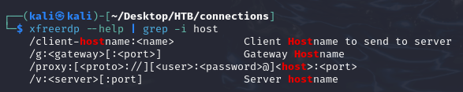
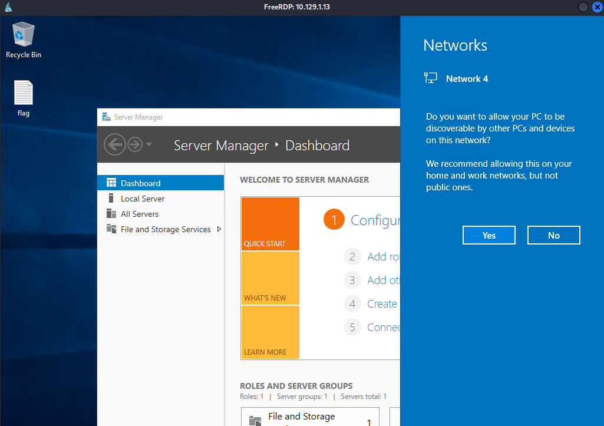
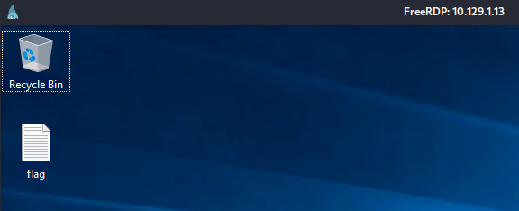
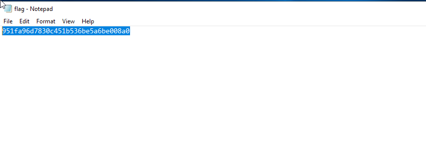
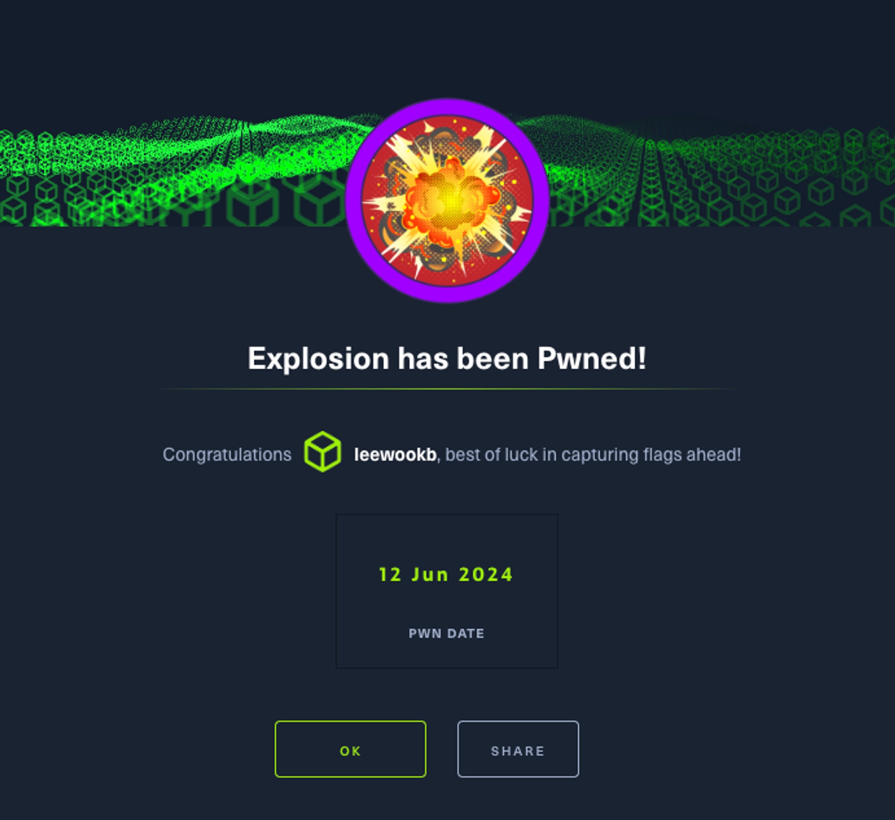

some thoughts:

It was really fascinating when I first tried connecting to an RDP server. I just typed a few appropriate commands in the terminal CLI, and suddenly a small screen popped up over the terminal, displaying the Windows desktop screen. It might seem like no big deal to some, but for me, it was an amazing experience. It showed me how powerful these commands and knowing various server protocols can be.
If felt like an explosion inside my brain! just like the name of the box.

<div style="text-align: center"></div>

---

##### TASK 1

What does 3-letter acronym RDP stand for?

```
Remote Desktop Protocol
```

Remote Desktop Protocol (RDP) is a proprietary protocol developed by Microsoft, allowing users to connect to and control a remote computer over a network connection.

</br>

##### TASK 2

What is a 3-letter acronym that refers to interaction with the host through a command line interface?

```
CLI
```

</br>

##### TASK 3

What about graphical user interface interactions?

```
GUI
```

<br/>

##### TASK 4

What is the name of an old remote access tool that came without encryption by default and listens on TCP port 23?

```
Telnet
```

Telnet is one of the oldest protocols, established in 1969. By default, Telnet operates over TCP port 23. One of Telnet's main drawbacks is that it transmits data, including login credentials, in plaintext. This lack of encryption makes it vulnerable to eavesdropping and man-in-the-middle attacks, which is why it has largely been replaced by more secure protocols like SSH (Secure Shell).

<br/>

##### TASK 5

What is the name of the service running on port 3389 TCP?

```
ms-wbt-server
```

```zsh
┌──(kali㉿kali)-[~/Desktop/HTB/connections]
└─$ nmap -sV 10.129.1.13 -p 3389
Starting Nmap 7.94SVN ( https://nmap.org ) at 2024-06-18 12:12 EDT
Nmap scan report for 10.129.1.13
Host is up (0.034s latency).

PORT STATE SERVICE VERSION
3389/tcp open ms-wbt-server Microsoft Terminal Services
Service Info: OS: Windows; CPE: cpe:/o:microsoft:windows

Service detection performed. Please report any incorrect results at https://nmap.org/submit/ .
Nmap done: 1 IP address (1 host up) scanned in 6.45 seconds

As you can see from the output, the ms-wbt-server service is running on port 3389/TCP.
Also, I am using my Kali-Linux VM since I have used up all of my Pwnbox time on Hack The Box.
```

</br>

##### TASK 6

What is the switch used to specify the target host's IP address when using xfreerdp?

```
/v:
```

<div style="text-align: center"></div>

<br/>

##### TASK 7

What username successfully returns a desktop projection to us with a blank password?

```
Administrator
```

```zsh
/cert-ignore [deprecated, use /cert:ignore] Ignore
certificate
```

```zsh
/u:[[<domain>\]<user>|<user>[@<domain>]]
Username
```

<div style="text-align: center"></div>
<div style="text-align: center"></div>

I was discovered useful switch options through the `xfreerdp --help` command, but I had no idea how to find a specific username that would allow me to connect to the RDP server with a blank password, as the RDP session was not accepting my own username. I had to look up the write-up provided by HTB, which revealed that the username was Administrator. Now that I know the username, I thought to myself, why didn't I think of trying '`Administrator`'?
The final command `xfreerdp /v:10.129.1.13 /cert-ignore /u:Administrator` connected me to the RDP server with a blank password.

</br>

##### SUBMIT FLAG

Submit root flag

```
951fa96d7830c451b536be5a6be008a0
```

<div style="text-align: center"></div>
<div style="text-align: center"></div>
