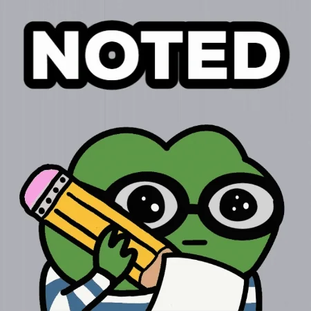

<div style="text-align: center"></div>

This box was easier compared to the previous two I attempted. However, I still referred to the provided walkthrough. I am trying to apply a `top-down` approach to my learning as a mentor advised me to. I feel too dependent on resources because I am not confident in my skills yet and have always relied on guided learning. I admit there is not shortcut; `trial and error` will benefit me in the long run.

---

#### What does the acronym CVE stand for?

```
Common Vulnerabilities and Exposures
```

<br>

#### What do the three letters in CIA, referring to the CIA traid in cybersecurity, stand for?

```
Confidentiality, Integrity, Availability
```

When I was studying for the CompTIA Security+ certification, the CIA triad was emphasized repeatedly throughout the course. I'm grateful for this question as it reminds me again of this important cybersecurity principle.

<br>

#### What is the version of the service running on port 8080?

```
Jetty 9.4.39.v20210325
```


<br>

#### What version of Jenkins is running on the target?

```
2.289.1
```

I couldn't determine the Jenkins version from the nmap scan results. The hint suggested checking the bottom right corner of the `admin` page, implying I needed admin access. I didn't know the admin credentials, but the walkthrough recommended searching for common weak credential pairs. The combination that worked was `root:password`.


<br>

#### What type of script is accepted as input on the Jenkins Script Console?

```
Groovy
```


<br>

#### What would the `String cmd` variable from the Groovy Script snippet be equal to if the Target VM was running Windows?

```
cmd.exe
```

I thought having access to a script console implies we need to create a reverse shell, meaning the target will initiate a connection back to our attacker VM. I referred to the Java version of the Reverse Shell Cheat Sheet because the Groovy script uses Java syntax. The Java Alternative 1 option shows that `String cmd` variable is equal to `cmd.exe` in Windows.


<br>


<br>

#### What is a different command than `ip a` we could use to display our network interfaces' information on Linux?

```
ifconfig
```


<br>

#### What switch should we use with netcat for it to use UDP transport mode?

```
-u
```


<br>

#### What is the term used to describe making a target host initiate a connection back to the attacker host?

```
reverse shell
```

<br>

#### Submit root flag

```
9cdfb439c7876e703e307864c9167a15
```

Since the target was linux based, I had to change the `String cmd="cmd.exe"` to `String cmd="/bin/bash"`. Before sending the payload, I started netcat to receive the reverse shell using the command: `nc -lvnp 1234`. I personally specified the port 1234 in the payload, and netcat was set to listen on that port.

After sucessfully receiving the reverse shell, I was able to locate the flag on the target host.


<br>


