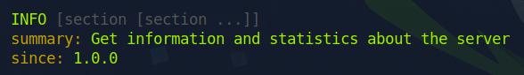
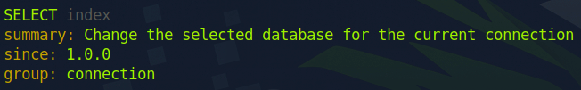
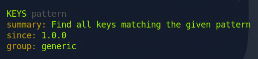
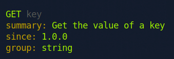

some thoughts:

This box was the most challenging one to crack so far, but I feel incredibly accomplished seeing my progress. I really enjoy writing about my experiences in this personal space, even though no one else is seeing it. I'm practicing not to rely on external sources unless I've tried everything I can on my own, and I'm really glad I've decided to do so. Working on this box has made me feel like I'm going to remember every step I took to get the flag.

<div style="text-align: center"></div>

---

##### TASK 1

Which TCP port is open on the machine?

```
6379
```

```zsh
┌─[us-starting-point-vip-1-dhcp]─[10.10.14.27]─[leewookb@htb-iwwc2qnr0i]─[~]
└──╼ [★]$ nmap -sC -sV 10.129.136.187
Starting Nmap 7.93 ( https://nmap.org ) at 2024-06-18 04:24 BST
Nmap scan report for 10.129.136.187
Host is up (0.027s latency).
All 1000 scanned ports on 10.129.136.187 are in ignored states.
Not shown: 1000 closed tcp ports (conn-refused)

Service detection performed. Please report any incorrect results at https://nmap.org/submit/ .
Nmap done: 1 IP address (1 host up) scanned in 0.71 seconds
```

Initially, scanning ports on the target IP address did not reveal any open ports. Therefore, I had to expand my scan to include more ports. By default, Nmap scans only the most commonly used 1,000 ports, which are statistically the most likely to be open based on real-world usage. By adding the **-p-** option, Nmap scans all 65,535 ports on the target IP address. This extended scan revealed that port 6379/tcp is open.

```zsh
┌─[us-starting-point-vip-1-dhcp]─[10.10.14.27]─[leewookb@htb-iwwc2qnr0i]─[~]
└──╼ [★]$ nmap -sV -T4 10.129.136.187 -p-
Starting Nmap 7.93 ( https://nmap.org ) at 2024-06-18 04:25 BST
Nmap scan report for 10.129.136.187
Host is up (0.068s latency).
Not shown: 65534 closed tcp ports (conn-refused)
PORT STATE SERVICE VERSION
6379/tcp open redis Redis key-value store 5.0.7

Service detection performed. Please report any incorrect results at https://nmap.org/submit/ .
Nmap done: 1 IP address (1 host up) scanned in 37.48 seconds
```

<br/>

##### TASK 2

which service is running on the port that is open on the machine?

```
redis
```

<br/>

##### TASK 3

what type of database is Redis? Choose from the following options:

(i) In-memory Database, (ii) Traditional Database

```
In-memory Database
```

Redis is known for its high performance. Storing data in memory allows Redis to achieve extremely low latency and high throughput compared to disk-based databases. It's commonly used as cache to speed up application performance by temporarily storing frequently accessed data.

<br/>

##### TASK 4

which command-line is used to interact with the Redis server? Enter the program name you would enter into the terminal without any arguments.

```
redis-cli
```

To be able to interact with the Redis server, we need to download the **redis-cli** utility. It can be downloaded using the command below.

**sudo apt install redis-tools**

<br/>

##### TASK 5

which flag is used with the Redis command-line utility to specify the hostname?

```
-h
```

```zsh
┌─[us-starting-point-vip-1-dhcp]─[10.10.14.27]─[leewookb@htb-iwwc2qnr0i]─[~]
└──╼ [★]$ redis-cli --help
redis-cli 7.0.10

Usage: redis-cli [OPTIONS] [cmd [arg [arg ...]]]
-h <hostname> Server hostname (default: 127.0.0.1).
```

<br/>

##### TASK 6

Once connected to a Redis server, which command is used to obtain the information and statistics about the Redis server?

```
info
```

The answer to this question was a bit challenging to find. A quick Google search would have provided it in seconds, but I wanted to challenge my self. After I got a successful connection with the Redis server, I typed the **help** command to gain some insights.

```zsh
10.129.136.187:6379> help
redis-cli 7.0.10
To get help about Redis commands type:
"help @<group>" to get a list of commands in <group>
"help <command>" for help on <command>
"help <tab>" to get a list of possible help topics
"quit" to exit
```

The output indicated that **help <tab>** command would list possible help topics. Each time I pressed the tab key, the topic changed. Then I found **@server** topic, which seemed promising since I was looking for a command to obtain the information and statistics about the Redis server.

```
10.129.136.187:6379> help @server
```

As I scrolled through the output of the command, I found the answer I was looking for.

<div style="text-align: center"></div>

<br/>

##### TASK 7

What is the version of the Redis server being used on the target machine?

```
5.0.7
```

```zsh
10.129.136.187:6379> info
# Server
redis_version:5.0.7
redis_git_sha1:00000000
redis_git_dirty:0
```

<br/>

##### TASK 8

Which command is used to select the desired database in Redis?

```
select
```

<div style="text-align: center"></div>
<br/>

##### TASK 9

How many keys are present inside the database with index 0?

```
4
```

```zsh
10.129.136.187:6379> dbsize
(integer) 4
10.129.136.187:6379>
```

<br />

##### TASK 10

Which command is used to obtain all the keys in a database?

```
keys *
```

<div style="text-align: center"></div>

```zsh
10.129.136.187:6379> keys *
1. "temp"
2. "numb"
3. "flag"
4. "stor"
   10.129.136.187:6379>
```

<br/>

##### SUBMIT FLAG

submit root flag

```
03e1d2b376c37ab3f5319922053953eb
```

<div style="text-align: center"></div>

```zsh
10.129.136.187:6379> get flag
"03e1d2b376c37ab3f5319922053953eb"
10.129.136.187:6379>
```
