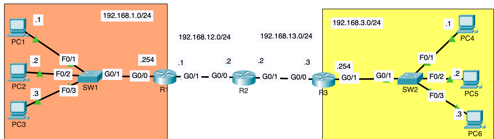
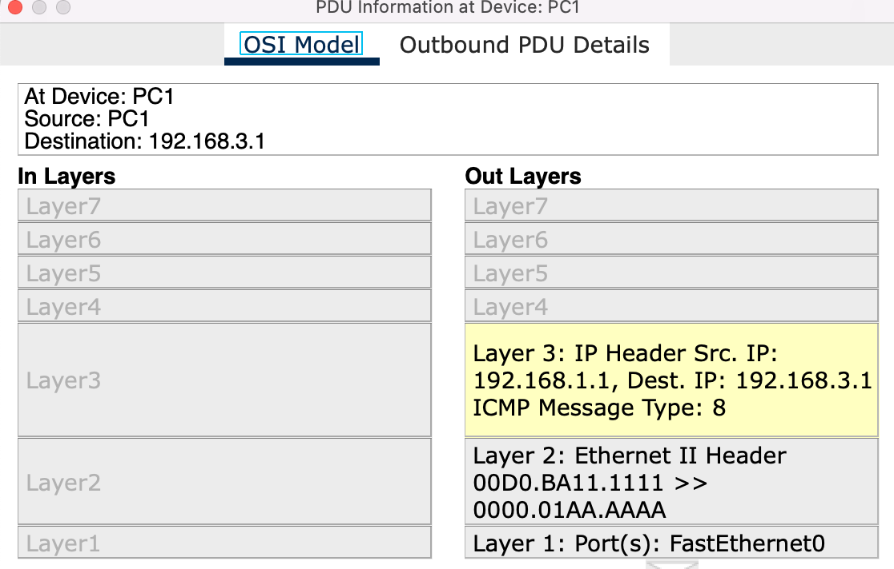
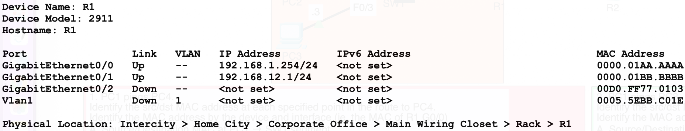
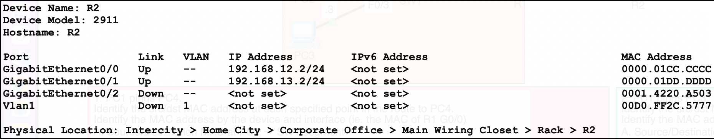
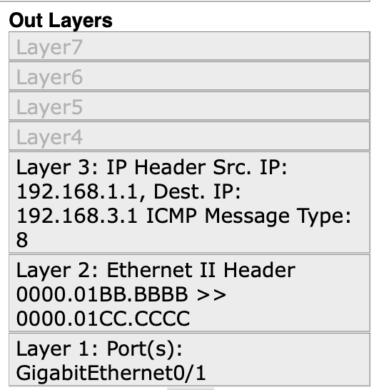
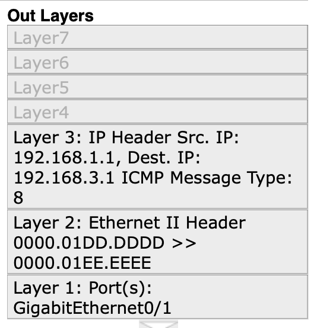
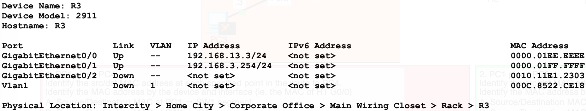

Today, while studying for my CCNA with Jeremy's IT Lab YouTube videos, I learned something very useful that I can't help but write about because I want to remember it for a long time and make the knowledge mine.

<div style="text-align: center"></div>

---

The image below is the network topology used in the Lab.

<div style="text-align: center"></div>

PC1 pings PC4.

Identify the source/destination MAC address at each specified point in the route to PC4.
Identify the MAC address by the device and interface (ie. the MAC of R1 G0/0)
</br>

##### Q1. Source/Destination MAC addresses at PC1 → SW1 segment

```
Source MAC Address: 1111
Destination MAC Address: AAAA
```

```
C:\>ipconfig /all

FastEthernet0 Connection:(default port)

Connection-specific DNS Suffix..:
Physical Address................: 00D0.BA11.1111
Link-local IPv6 Address.........: FE80::2D0:BAFF:FEE1:6988
IPv6 Address....................: ::
IPv4 Address....................: 192.168.1.1
Subnet Mask.....................: 255.255.255.0
Default Gateway.................: ::
192.168.1.254
DHCP Servers....................: 0.0.0.0
DHCPv6 IAID.....................:
DHCPv6 Client DUID..............: 00-01-00-01-09-99-E5-2C-00-D0-BA-11-11-11
DNS Servers.....................: ::
0.0.0.0
```

the last four digits of PC1's MAC Address is **1111** . We are sending a packet from PC1 to PC4, which means the source IP Address is **192.168.1.1** (PC1's IP Address) and the destination IP Address is **192.168.3.1** (PC4's IP Address). The source and destination IP Address remain unchanged throughout the communication. Because PC4 is located on a different network, PC1 will encapsulate the packet with an Ethernet header and the destination MAC address will be the MAC address of its **default gateway**. In this case, it's R1's g0/0 interface. It will be the destination MAC address.

```
R1>enable
R1#show interfaces g0/0
GigabitEthernet0/0 is up, line protocol is up (connected)
Hardware is CN Gigabit Ethernet, address is 0000.01aa.aaaa (bia 00d0.ff77.0101)
```

The last four digits of R1's g0/0 interface MAC address is **aaaa** .

<div style="text-align: center"></div>

<br/>

##### Q2. Source/Destination MAC addresses at SW1 → R1 segment.

```
Source MAC Address: 1111
Destination MAC Address: AAAA
```

The Source/Destination MAC addresses at SW1 to R1 segment should be the same as Q1. Switches do not change the source and destination MAC addresses in the frame. It will simply use the source MAC address field in the Ethernet header to learn PC1's MAC address if it doesn't already know it, and then forward the frame to the proper destination, or flood it if it hasn't learned the destination MAC address yet.

<br/>

##### Q3. Source/Destination MAC addresses at R1 → R2 segment

```
Source MAC address: BBBB
Destination MAC address: CCCC
```

Like I already mentioned, the source and destination IP addresses will remain the same, as R1 encapsulates the packet with an Ethernet header, it will use the MAC address of its g0/1 interface as the source MAC address and the MAC address of R2's g0/0 interface, which is the next hop in the route, as the destination MAC address.

<div style="text-align: center"></div>

The last four digits of R1's g0/1 interface MAC address is **BBBB**.

<div style="text-align: center"></div>

The last four digits of R2's g0/0 interface MAC address is **CCCC**.

<div style="text-align: center"></div>

Here, on Cisco Packet Tracer, we can confirm the source/destination MAC address on the Ethernet header in Layer 2.

<br/>

##### Q4. Source/Destination MAC addresses at R2 → R3 segment.

```
Source MAC address: DDDD
Destination MAC address: EEEE
```

The source MAC address will be R2's interface g0/1 and the destination MAC address will be R3's interface g0/0.

<div style="text-align: center"></div>

The last four digits of R2's interface g0/1 MAC address is **DDDD**.

<div style="text-align: center"></div>

The last four digits of R3's interface g0/0 MAC address is **EEEE**.

<div style="text-align: center"></div>

<br/>

##### Q5. E. Source/Destination MAC addresses at R3 → SW2 segment.

```
Source MAC address: FFFF
Destination MAC address: 4444
```

At this point, the destination IP address is part of a network connected to R3, **192.168.3.0/24** , so R3 knows it can send the packet directly to PC4. So, it will set the destination MAC address to PC4's MAC address, and use its own address as the source.

The source MAC address will be R3's g0/1 interface, which is **FFFF** .

<div style="text-align: center"></div>

The destination MAC address will be PC4's MAC address, which turned out to be **4444** (the last 4 digits).

```
Cisco Packet Tracer PC Command Line 1.0
C:\>ipconfig /all

FastEthernet0 Connection:(default port)

Connection-specific DNS Suffix..:
Physical Address................: 000C.8544.4444
Link-local IPv6 Address.........: FE80::20C:85FF:FEC4:BDB4
IPv6 Address....................: ::
IPv4 Address....................: 192.168.3.1
Subnet Mask.....................: 255.255.255.0
Default Gateway.................: ::
192.168.3.254
DHCP Servers....................: 0.0.0.0
DHCPv6 IAID.....................:
DHCPv6 Client DUID..............: 00-01-00-01-2D-AC-7E-D8-00-0C-85-44-44-44
DNS Servers.....................: ::
0.0.0.0
```

<br/>

##### Q6. Source/Destination MAC addresses at SW2 → PC4 segment.

```
Source MAC address: FFFF
Destination MAC address: 4444
```

The answer for Q6 is the same as Q5 because the SW2 only forwards the frame. The switch does not alter the source or destination MAC addresses in the Ethernet frame. The switch's role is to efficiently forward the frame to the correct destination based on its MAC address table. If it doesn't already know the destination MAC address, it will flood the frame.
