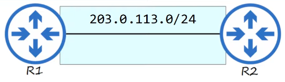
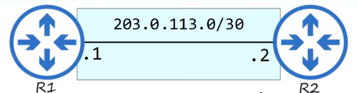

Today marks day 13 of studying CCNA with Jeremy's IT Lab. Today's topic was subnetting. Even though the topic was challenging to grasp at first, it's really interesting how people came up with such ideas to efficiently utilize the IP addressing system. People are geniuses!

---

### IPv4 Address Classes

There are 5 different IPv4 classes

A **subnet** refers to a portioned network within an IP address that divides the network area. The tool used to create these subnets is called a **Subnet Mask**. In other words, the Subnet Mask serves to separate the Network ID and the Host ID within the IP address system.

For example, as shown in the image above, a **Class C** network has the first 24 bits representing the Network ID and the last 8 bits representing the Host ID. In this case, the actual number of assignable hosts within the 8-bit Host ID is 2^8 - 2 = 254.

The formula for the actual number of assignable hosts is **2^n - 2**, where n is the number of bits in the Host ID. But why do we subtract 2? This is because we must exclude the **Network Address** and the **Broadcast Address**. These two addresses cannot be assigned to hosts.

 

### CIDR (Classless Inter-Domain Routing)

The class system has a critical problem, that is, it wastes a lot of IP addresses. When the Internet was first created, the creators did not predict that the Internet would become as large as it is today. This resulted in wasted address space.

The IETF (Internet Engineering Task Force) introduced CIDR in 1993 to replace the 'classful' addressing system.

With CIDR, the requirements of

- Class A = /8
- Class B = /16
- Class C = /24

were removed. This allowed larger networks to be split into smaller networks, allowing greater efficiency. These small networks are called **subnetworks** or **subnets** .

 

Wasted IP addresses example

Here, we have two routers that we want to connect. This network is a **point-to-point** network, so we don't need many network blocks. Therefore, we allocate a Class C network. Since we allocated a Class C network, the Network ID will be 24 bits, and the Host ID will be 8 bits, giving us a total of 2^8 = 256 addresses. However, subtracting the network address (203.0.113.0) and the broadcast address (203.0.113.255), we have a total of 254 usable addresses.

But let's say we are using the classful addressing system without CIDR introduced. In this case, out of the 254 addresses, if we assign one address to R1 (e.g., 203.0.113.1) and one address to R2 (e.g., 203.0.113.2), then 252 addresses will be unused and wasted.

Let's look at another example.

Company X needs IP addresses to connect 5000 end hosts. Since Class C can only allocate 2^8-2, or 254 addresses, we would have to allocate a Class B to X. A Class B provides 2^16-2, or 65,534 addresses. This means Company X, which only needs 5000 addresses, would waste over 60,000 IP addresses.

### Subnetting

Due to the waste of too many IP addresses, subnetting is essential. Returning to the same example, let's assign IP addresses to this point-to-point network using **/30** (which is a subnet of that larger Class C network).

203.0.113.0/30 includes addresses from 203.0.113.0 to 203.0.113.3. When converted to binary, the IP addresses are as follows:

- 203.0.113.0 = 11001011.00000000.01110001.00000000
- 203.0.113.1 = 11001011.00000000.01110001.00000001
- 203.0.113.2 = 11001011.00000000.01110001.00000010
- 203.0.113.3 = 11001011.00000000.01110001.00000011

We assign 203.0.113.1 and 203.0.113.2 to R1 and R2, respectively. (Since this was a point-to-point network, we could also use /31 instead of /30 since poin-to-point networks do not need 2 extra addresses for network and broadcast addresses.)
Earlier, we mentioned that **/30** is a subnet of the **/24** address. So, what happens to the remaining addresses from 203.0.113.4 to 203.0.113.255 in the 203.0.113.0/24 network? These remaining addresses can be used in other subnets to prevent any waste of IP address.
