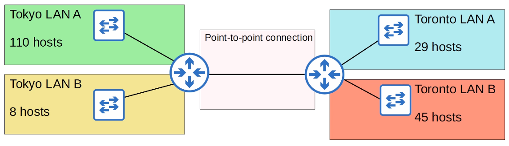
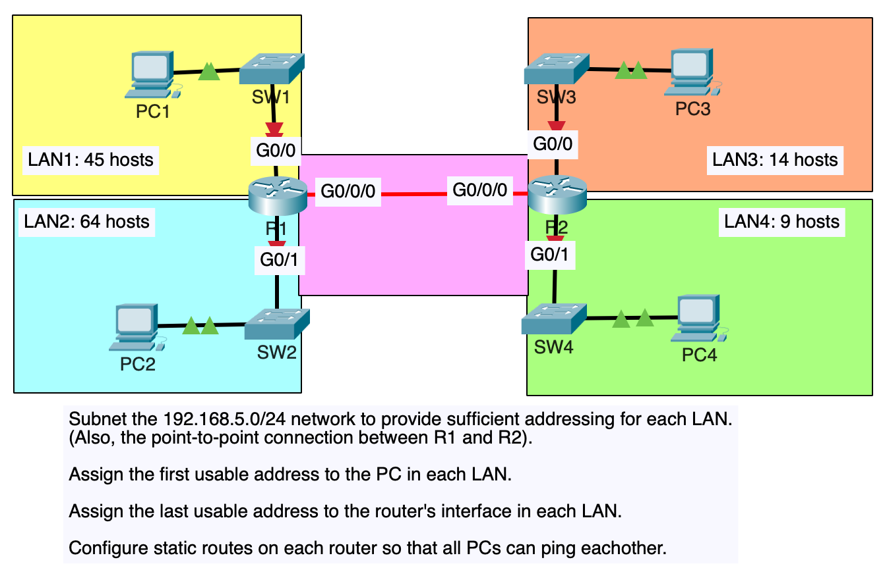

### VLSM (Variable-Length Subnet Masks)

Until now, I have practiced subnetting used FLSM (Fixed-Length Subnet Masks). This means that all of the subnets use the same prefix length (ie. subnetting a Class C network into 4 subnets using /26).

VLSM (Variable-Length Subnet Masks) is the process of creating subnets of different sizes, to make your use of network addresses more efficient.

<br>
<div style="text-align: center"></div>

Here's an example of a small enterprise network. There are two LANs in Tokyo and two LANs in Toronto. We are assigned the `192.168.1.0/24` network and must divide it into 5 subnets to provide IP addresses for all hosts in the enterprise network.

If we were to try this with FLSM (Fixed-length subnet masks), we would need to borrow 3 bits to make enough subnets. That would leave 5 host bits left. 5 host bits only allow 30 host addresses, so that's not enough addresses for Tokyo LAN A and Toronto LAN B.

However, if we use VLSM we can assign different subnet sizes to each LAN, which will allow us to make sure each LAN has enough addresses available.

<br>

### Steps to subnet using VLSM

1. Assign the largest subnet at the start of the address space.
2. Assign the second-largest subnet after it.
3. Repeat the process until all subnets have been assigned.

If we look at our network above, we will assign subnets in this following order:

1. Tokyo LAN A
2. Toronto LAN B
3. Toronto LAN A
4. Tokyo LAN B
5. point-to-point connection

<br>

### Tokyo LAN A

Because we need to accommodate 110 hosts for Tokyo LAN A, we have to have at least 7 host bits, which leads to /25 prefix length.

Convert the original address to binary bits

- 11000000.10101000.00000001.00000000

Network address in binary

- 11000000.10101000.00000001.00000000

Broadcast address in binary

- 11000000.10101000.00000001.01111111

```
Network address: 192.168.1.0/25
Broadcast address: 192.168.1.127/25
First usable address: 192.168.1.1/25
Last usable address: 192.168.1.126/25
Total number of usable host addresses: 2^7 - 2 = 126
```

<br>

### Toronto LAN B

We have our first subnet, 192.168.1.0/25 for Tokyo LAN A. The network address of Toronto LAN B should be 192.168.1.128, just 1 up Tokyo LAN A's broadcast address. However, we have to calculate what prefix length we should use for Toronto LAN B.

Because Toronto LAN B has to have 45 hosts, that means we have to have 6 host bits. That means, the prefix length of the subnet is going to be /26.

Network address in binary

- 11000000.10101000.00000001.10000000

Broadcast address in binary

- 11000000.10101000.00000001.10111111

```
Network address: 192.168.1.128/26
Broadcast address: 192.168.1.191/26
First usable address: 192.168.1.129/26
Last usable address: 192.168.1.190/26
Total number of usable host addresses: 2^6 - 2 = 62
```

<br>

### Toronto LAN A

Next is subnetting Toronto LAN A. The broadcast address of the previous subnet, Toronto LAN B, is 192.168.1.191/26. So, the network address of Toronto LAN A is 192.168.1.192, we just need to figure out the prefix length.

Since we need to accommodate 29 hosts, we need to have 5 host bits. 2 ^ 5 - 2 = 30, which means the prefix length of the subnet is going to be /27.

Network address in binary

- 11000000.10101000.00000001.11000000

Broadcast address in binary:

- 11000000.10101000.00000001.11011111

```
Network address: 192.168.1.192/27
Broadcast address: 192.168.1.223/27
First usable address: 192.168.1.193/27
Last usable address: 192.168.1.222/27
Total number of usable host addresses: 30
```

<br>

### Tokyo LAN B

The broadcast address of Toronto LAN A is 192.168.1.223/27. To get the network address of Tokyo LAN B, we just need to add 1 to it. 192.168.1.224. Tokyo LAN B needs to have 8 hosts, which means 4 host bits are needed. The prefix length is /28.

Network address in binary

- 11000000.10101000.00000001.11100000

Broadcast address in binary

- 11000000.10101000.00000001.11101111

```
Network address: 192.168.1.224/28
Broadcast address: 192.168.1.239/28
First usable address: 192.168.1.225/28
Last usable address: 192.168.1.238/28
Total number of usable host addresses: 2 ^ 4 - 2 = 14.
```

<br>

### Point-to-point connection

The broadcast address of Tokyo LAN B is 192.168.1.239. Therefore, the network address of point-to-point connection is 192.168.1.240. Since this is a point-to-point connection, we only need to accommodate 2 hosts. Two answers are possible for this, the first choice is /31 prefix length. However, for the CCNA test, if you are asked what prefix length to use for a subnet that requires two hosts, it is recommended not using a /31 prefix length.

Then, our other option is /30 prefix length because we need 2 host bits. (2 ^ 2 - 2 = 2).

Network address in binary

- 11000000.10101000.00000001.11110000

Broadcast address in binary

- 11000000.10101000.00000001.11110011

```
Network address: 192.168.1.240/30
Broadcast address: 192.168.1.243/30
First usable address: 192.168.1.241/30
Last usable address: 192.168.1.242/30
Total number of usable host addresses: 2
```

<br>

<div style="text-align: center"></div>
Notice that each subnet uses a different prefix length. If we tried to use the same prefix length for each subnet, there wouldn't be enough address space.

---

### VLSM LAB



We will assign the subnets in the following order:

1. LAN 2 (64 hosts)
2. LAN 1 (45 hosts)
3. LAN 3 (14 hosts)
4. LAN 4 (9 hosts)
5. Point-to-point (2 hosts)

#### LAN 2

convert the `192.168.5.0/24` network address to binary:

- `11000000.10101000.00000101.000000`

Because we have to accommodate 64 hosts for LAN 2, we need 7 host bits `2^7 - 2 = 126`. That means, the prefix length of the subent will be `/25`.

Network address in binary

- `11000000.10101000.00000101.000000`

Broadcast address in binary

- `11000000.10101000.00000101.01111111`

```
Network address: 192.168.5.0/25
Broadcast address: 192.168.5.127/25
First usable address: 192.168.5.1/25
Last usable address: 192.168.5.126/25
```

#### LAN 1

The subnet with the second biggest hosts is LAN 1.
We know the broadcast address of LAN 2, so the network address of LAN 1 is just `broadcast address of LAN 2 + 1`.

However, we still need to find the prefix length. LAN 1 needs to accomodate 45 hosts, which needs 6 host bits. That leads to `/26` prefix length.

Convert the network address `192.168.5.128/26` to binary:

- `11000000.10101000.00000101.10000000`.

Broadcast address in binary:

- `11000000.10101000.00000101.10111111`.

```
Network address: 192.168.5.128/26
Broadcast address: 192.168.5.191/26
First usable address: 192.168.5.129/26
Last usable address: 192.168.5.190/26
```

#### LAN 3

Network address: `192.168.5.192`
prefix length: `/28`

Network address in binary:

- `11000000.10101000.00000101.11000000`

Broadcast address in binary:

- `11000000.10101000.00000101.11001111`

```
Network address: 192.168.5.192/28
Broadcast address: 192.168.5.207/28
First usable address: 192.168.5.193/28
Last usable address: 192.168.5.206/28
```

### LAN 4

Network address: `192.168.5.208`
Prefix length:`/28`

Network address in binary:

- `11000000.10101000.00000101.11010000`

Broadcast address in binary:
`11000000.10101000.00000101.11011111`

```
Network address: 192.168.5.208/28
Broadcast address: 192.168.5.223/28
First usable address: 192.168.5.209/28
Last usable address: 192.168.5.222/28
```

### Point-to-point

Network address: `192.168.5.224`
prefix length: `/30`

Network address in binary:

- `11000000.10101000.00000101.11100000`

Broadcast address in binary:

- `11000000.10101000.00000101.11100011`

```
Network address: 192.168.5.224/30
Broadcast address: 192.168.5.227/30
First usable address: 192.168.5.225/30
Last usable address: 192.168.5.226/30
```

---

Resources for practicing subnetting

- http://www.subnettingquestions.com
- http://subnetting.org
- https://subnettingpractice.com
