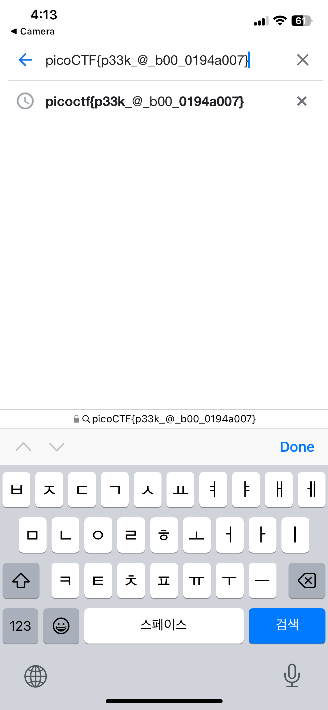

### Description

 

I've gotton bored of handing out flags as text.
Wouldn't it be cool if they were an image instead?

---

This is what wee see when we first log into the ssh server, a QR code.

The one thing we could easily do to capture the flag is to scan the QR code with our mobile phones since they have included native QR code scanner in their cameras since _version 8_ and _iOS 11_.

This is a screenshot of my camera app scanning the QR code, as you can see the camera app automatically recognizes the QR code and it's directing us to a destination.

Looks like we got the flag.

**_flag_**: `picoCTF{p33k_@_b00_0194a007}`

---

One of the hints tells us that if you don't have access to a phone, you can also use `zbar-tools` to convert an image to text.
