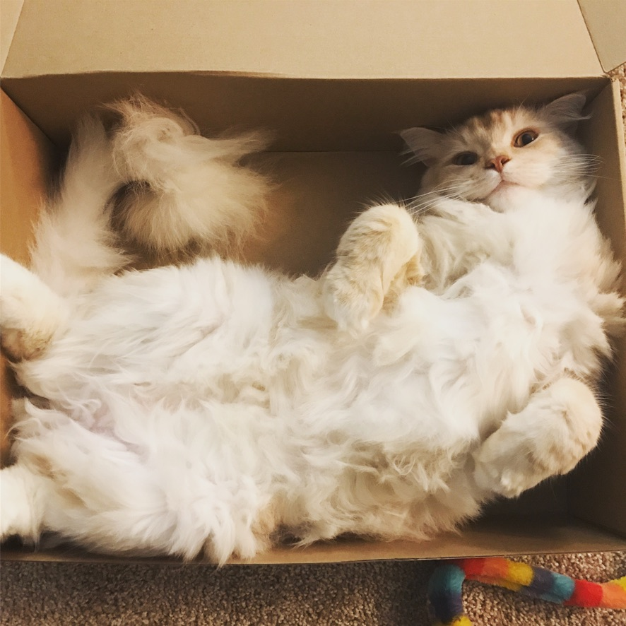
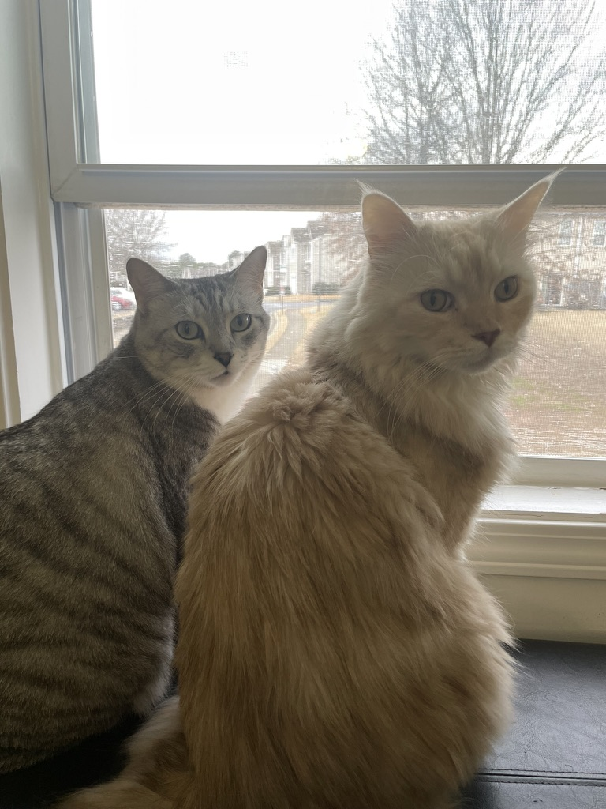
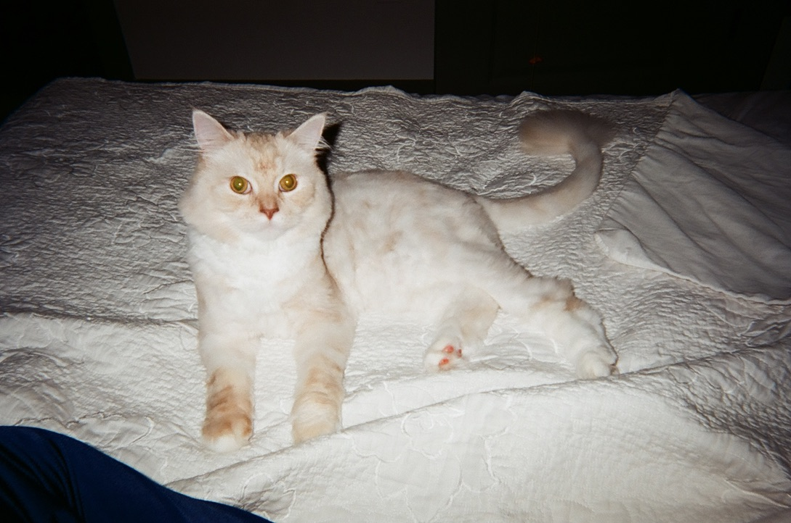
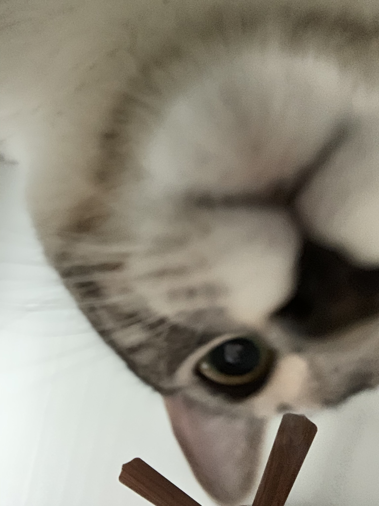

    

    

<!-- Image 4 -->

    

<!-- Image 2 -->

    

<!-- Image 3 -->

    

<!-- Image 5 -->

    

<!-- Image 6 -->

    

<!-- Image 7 -->

    

<!-- Image 8 -->

    

<!-- Image 9 -->

    

