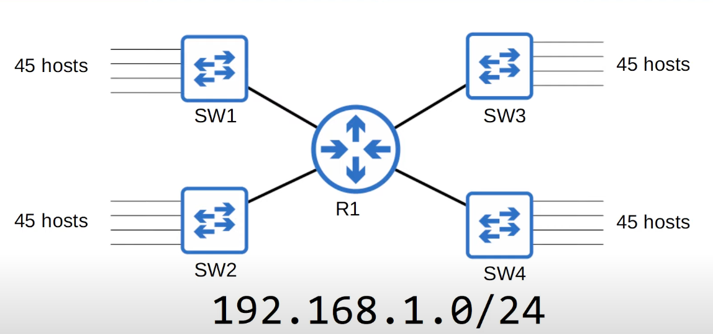
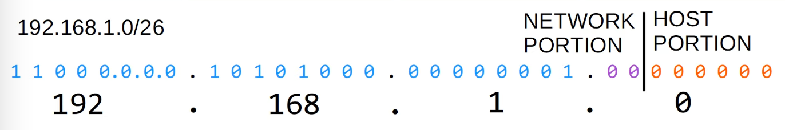
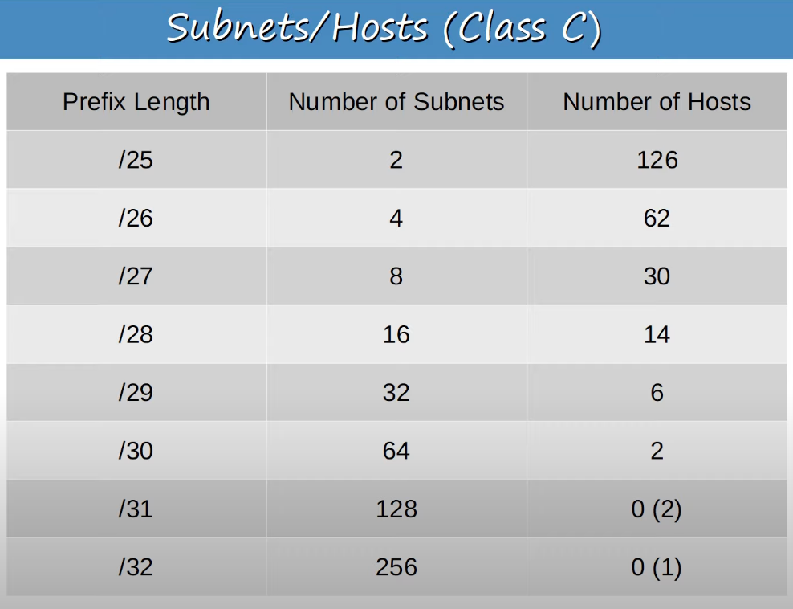
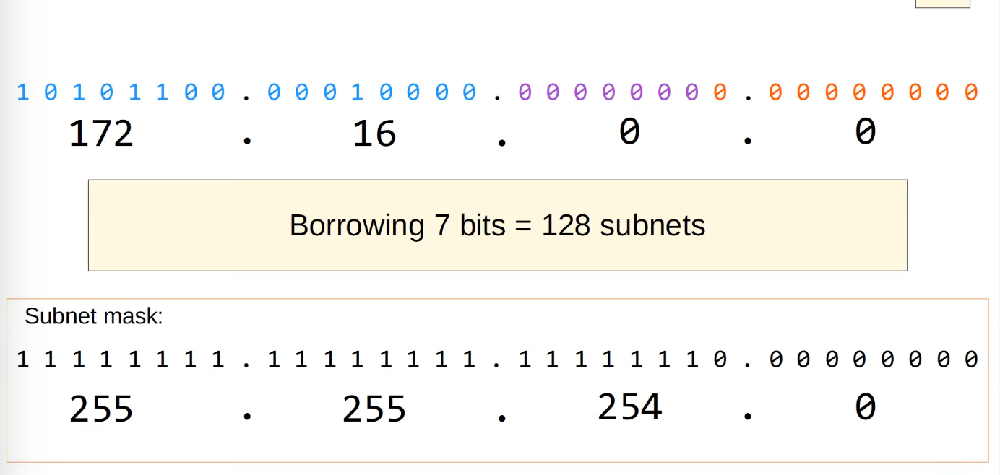

<div style="text-align: center"></div>

Divide the `192.168.1.0/24` network into 4 subnets that can accommodate 45 number of hosts.

First, we determined that the prefix length needs to be `/26` because each subnet must be able to include 45 hosts. The formula to calculate the number of hosts is `2^n - 2`, where n is the number of host bits. If there are 5 host bits, then 2^5 - 2 = 30, which is not enough to include 45 hosts. Therefore, we need 2^6 - 2 = 62, which isn't exactly 45 but is sufficient. To accommodate 45 hosts, we need 6 host bits. This makes the prefix length /26, since we subtract the 6 host bits from the total address length of 32.

The network address of `subnet 1` is 192.168.1.0/26. To find the broadcast address of subnet 1, we first convert the subnet 1 address to binary:
`11000000.10101000.00000001.00000000`

Then, we change all the Host ID bits to 1, leaving the Network ID bits unchanged:
`11000000.10101000.00000001.00111111`

Converting these binary bits back to dotted decimal format gives us the broadcast address (the highest address in this subnet) of subnet 1.
`192.168.1.63/26`.

So, the address range of subnet1 is 192.168.1.0 - 192.168.1.63.

The network address of `subnet 2` will be 1 higher than the broadcast address of `subnet 1`. So, 192.168.1.64/26.

192.168.1.64 in binary is `11000000.10101000.00000001.01000000`.
Covert all the host bits to 1s. `11000000.10101000.00000001.01111111`

Convert the binary bits back to dotted decimal and it becomes `192.168.1.127`.

The address range of subnet 2 is 192.168.1.64 to 192.168.1.127.

You might have noticed that each subnet is 64 bits apart. To find next subnet's network address, simply add this value to the current subnet.

Take the image below as an example.

<div style="text-align: center"></div>

Let's just focus on the last octet here. The last octet in binary is `00000000`. The first 2 bits is the network ID, which we borrowed to expand the network ID and the last 6 bits is the host ID. The trick to find each subnet's network address is to remember the value of last bit of the network portion, which is 64, in this case.

<br>
<br>
<br>

<div style="text-align: center"></div>
For the number of subnets, each additional bit that you borrow doubles the number of subnets.

### Subnetting Class B Networks

1. You have been given the 172.16.0.0/16 network. You are asked to create 80 subnets for your company's various LANs. What prefix length should you use?

   2^x = number of subnets, where x is the number of 'borrowed' bits.

<div style="text-align: center"></div>
we have to borrow 7 bits. 16 + 7 = /23.

2. You have been given the `172.22.0.0/16` network. You are required to divide the network into 500 separate subnets. What prefix should you use?

First of all, looking at the /16 prefix length, it seems like subnetting needs to be done in a Class B network. To create 500 subnets, we need to determine how many bits to borrow.

2^8 is 256, and 2^9 is 512. Therefore, we need to borrow 9 bits. Starting from a Class B network, which has a /16 prefix length, we add 9 bits to get a /25 prefix length. This means we should use a /25 prefix length.

3. You have been given the `172.18.0.0/16` network. Your company requires 250 subnets with the same number of hosts per subnet. What prefix length should you use?

`/24` . 2^8 = 256 subnets could be made. Also /24 prefix length will leave 8, the number of host bits which could lead to 2^8 - 2, 254.

4. What subnet does host 172.25.217.192/21 belong to?

   Let's convert `172.25.217.192` to binary bits.
   10101100.00011001.11011001.11000000

   change all of the host bits to 0.
   10101100.00011001.11011000.00000000

   change it back to dotted decimal.
   172.25.216.0/21

### Quiz

---

Q1. You have been given the `172.30.0.0/16` network. Your company requires 100 subnets with at least 500 hosts per subnet. What prefix length should you use?

```
/23
```

<br>

Q2. What subnet does host `172.21.111.201/20` belong to?

```
172.21.96.0/20
```

- Convert the address to binary: `10101100.00010101.01101111.11001001`
- Change the host bits to 0s. Since the prefix length is `/20` , we can set the last 12 bits to 0s: `10101100.00010101.01100000.00000000`
- Convert the binary bits back to dotted decimal: `172.21.96.0/20`

<br>

Q3. What is the broadcast address of the network 192.168.91.78/26 belongs to?

```
192.168.91.127/26
```

- Convert the address to binary bits:
  - `11000000.10101000.01011011.01001110`.
- Change all of the host bits to 0s to find the network address of the subnet:
  - `11000000.10101000.01011011.01000000`.
- Change all of the host bits to 1s to find the broadcast address of the subnet:
  - `11000000.10101000.01011011.01111111`.
- Change the binary bits back to dotted decimal
  - network address: 192.168.91.64/26
  - broadcast address: 192.168.91.127/26

<br>

Q4. You divide the `172.16.0.0/16` network into 4 subnets of equal size. Identify the network and broadcast addresses of the second subnet.

```
network address: 172.16.64.0/18
broadcast address: 172.16.127.255/18
```

- The original subnet mask for a /16 network is 255.255.0.0.
- Dividing into 4 subnets require 2 additional bits for subnetting (2^2 = 4).
- This changes the subnet mask to 255.255.192.0 /18.
- The original network 172.16.0.0/16 is divided as follows with a /18 mask:
  - subnet1: 172.16.0.0/18
  - subnet2: 172.16.64.0/18
  - subnet3: 172.16.128.0/18
  - subnet4: 172.16.192.0/18
- We know that subnet 2's broadcast address is just 1 below subnet 3's network address: 172.16.127.255/18

<br>

Q5. You divide the 172.30.0.0/16 network into subnets of 1000 hosts each. How many subnets are you able to make?

```
64
```

To divide the network into subnets that each accommodate 1,000 hosts, we first need to determine how many bits are required for the hosts. The formula for calculating the number of hosts is `2^n - 2`, where n is the number of host bits. If we use 10 bits for the hosts, we get 2^10 - 2 = 1,022 hosts, which is more than enough.

The maximum prefix length is /32. Subtracting the 10 host bits from 32 gives us a prefix length of /22. Therefore, the subnet mask of the subnets will be /22. The original subnet mask was /16, so we've borrowed 6 bits from the original network for subnetting. With these 6 additional bits, we can create 64 (2^6) subnets.
